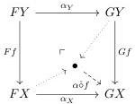
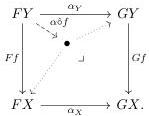
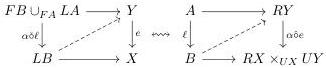

Example 2.1.13 ([Lur09, 6.1.6.4–7][Shu19, 4.18]). For any locally presentable and locally cartesian closed category E, for sufficiently large regular cardinals  \( \kappa \) , the relatively  \( \kappa \) -presentable morphisms form a locally representable and relatively acyclic full notion of fibred structure  \( E^{\kappa} \) .⁸

Locally representable notions of fibred structure may also be transferred from one category to another via various devices. Here we make use of a transfer result involving the Leibniz construction of [RV14, §4–5], deployed in the following setting.

Definition 2.1.14. Consider the application bifunctor

\[
\mathsf {E} ^ {\mathsf {D}} \times \mathsf {D} \xrightarrow {\circ} \mathsf {E}
\]

\[
(F, X) \longmapsto F X
\]

associated to a pair of categories D and E. Assuming E has pushouts and pullbacks, this induces Leibniz pushout application and Leibniz pullback application bifunctors

\[
\mathsf {E} ^ {\mathsf {D} \times 2} \times \mathsf {D} ^ {2} \xrightarrow {\delta} \mathsf {E} ^ {2} \quad \mathsf {E} ^ {\mathsf {D} \times 2} \times \mathsf {D} ^ {2} \xrightarrow {\delta} \mathsf {E} ^ {2}
\]

which, respectively, send a natural transformation \(\alpha \colon F \Rightarrow G\) and an arrow \(f \colon Y \to X\) to the induced maps in the naturality squares:

Lemma 2.1.15. Suppose D and E have weak factorization systems  \( (\mathcal{L},\mathcal{R}) \)  and  \( (\mathcal{M},\mathcal{E}) \)  respectively. Then the Leibniz pushout application of a natural transformation  \( \alpha\colon F\Rightarrow L \)  between left adjoints preserves the left classes if and only if the Leibniz pullback application of the conjugate natural transformation  \( \alpha\colon R\Rightarrow U \)  between the right adjoints preserves right classes.

Proof. Write  \( \operatorname{Ladj}(\mathsf{D},\mathsf{E})\subset\mathsf{E}^{\mathsf{D}} \)  and  \( \operatorname{Radj}(\mathsf{E},\mathsf{D})\subset\mathsf{D}^{\mathsf{E}} \)  for the full subcategories spanned by the left and right adjoint functors, respectively. Note we have an equivalence of categories  \( \operatorname{Ladj}(\mathsf{D},\mathsf{E})^{\mathrm{op}}\simeq\operatorname{Radj}(\mathsf{E},\mathsf{D}) \)  which exchanges left and right adjoints and conjugate transformations. Moreover, via this equivalence, the restricted application bifunctors

\[
\operatorname{Ladj} (D, E) \times D \xrightarrow {\circ} E \quad \operatorname{Radj} (E, D) \times E \xrightarrow {\circ} D
\]

are parametrized adjoints. Thus, by [RV14, 4.10, 4.11], the Leibniz pushout application of left adjoints bifunctor and Leibniz pullback application of right adjoints bifunctor are parametrized adjoints, inducing a bijective correspondence between lifting problems:

for \(\ell\colon A\to B\) in \(\mathcal{L}\) and \(e\colon Y\to X\) in \(\mathcal{E}\). The claim follows.

\( ^{8} \) In a presheaf topos  \( E = Set^{Cop} \)  where C is  \( \kappa \) -small, the relatively  \( \kappa \) -presentable morphisms coincide with the  \( \kappa \) -small morphisms, those maps whose fibers have cardinality less than  \( \kappa \)  [Shu19, 4.10].

16