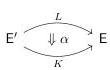
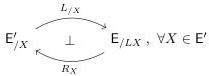

**Lemma 2.1.16.** Suppose $\mathsf{E}$ and $\mathsf{E}'$ have pullbacks, $\alpha : L \Rightarrow K : \mathsf{E}' \to \mathsf{E}$ is a natural transformation between pullback-preserving functors, and $L$ has an indexed right adjoint:

Then if $\mathsf{E}$ has a notion of fibred structure $\mathfrak{F}$, then $\mathsf{E}'$ has a notion of fibred structure $\mathfrak{F}'$ in which $\mathfrak{F}'$-algebras are created from $\mathfrak{F}$-algebras under the Leibniz pullback application of $\alpha$. Moreover,

- (i) if $\mathfrak{F}$ is relatively acyclic, so is $\mathfrak{F}'$, and
- (ii) if $\mathsf{E}$ is locally cartesian closed and $\mathfrak{F}$ is locally representable, so is $\mathfrak{F}'$.

Proof. Since the functor $\alpha \circ - : (\mathsf{E}')^2 \to \mathsf{E}^2$ preserves pullbacks, $\mathfrak{F}'$ defines a notion of fibred structure on $\mathsf{E}'$. Since $L$ and $K$ preserve pullbacks, they preserve monomorphisms, so the functor $\alpha \circ -$ preserves the monomorphisms in Definition 2.1.7, and thus if $\mathfrak{F}$ is relatively acyclic, so is $\mathfrak{F}'$.

It remains to verify local representability. To that end, consider a pullback in $\mathsf{E}'$

$$\begin{array}{c} W \xrightarrow{f^*g} Y \\ g^*f \Big\downarrow \quad \quad \quad \quad \quad \quad \quad \quad \quad \quad \quad \quad \quad \quad \quad \quad \quad \quad \quad \quad \quad \quad \quad \quad \quad \quad \quad \quad \quad \quad \quad \quad \quad \quad \quad \quad \quad \quad \quad \quad \quad \quad \quad \quad \quad \quad \quad \quad \quad \quad \text{ } f \\ Z \xrightarrow{g} X \end{array}$$

inducing a pullback in $\mathsf{E}$ as below-left:

$$\begin{array}{c} LW \xrightarrow{Lf^*g} LY \\ \alpha \circ g^*f \Big\downarrow \quad \quad \quad \quad \quad \quad \quad \quad \quad \quad \quad \quad \quad \quad \quad \quad \quad \quad \quad \quad \quad \quad \quad \quad \quad \quad \quad \quad \quad \quad \quad \quad \quad \quad \quad \quad \quad \quad \quad \quad \quad \quad \quad \quad \quad \quad \quad \quad \quad \quad \text{ } \\ KW \times_{KZ} LZ_{Kf^*g \times_{Kg}Lg} KY \times_{KX} LX \end{array}$$

$$\begin{array}{c} \mathfrak{F}(\alpha \circ g^*f) \longrightarrow \mathfrak{F}(\alpha \circ f) \\ \phi_{\alpha \circ g^*f} \Big\downarrow \quad \quad \quad \quad \quad \quad \quad \quad \quad \quad \quad \quad \quad \quad \quad \quad \quad \quad \quad \quad \quad \quad \quad \quad \quad \quad \quad \quad \quad \quad \quad \quad \quad \quad \quad \quad \quad \quad \quad \quad \quad \quad \quad \quad \quad \quad \quad \quad \quad \quad \text{ } \\ KW \times_{KZ} LZ_{Kf^*g \times_{Kg}Lg} KY \times_{KX} LX. \end{array}$$

By definition $\mathfrak{F}'$-algebra structures on $g^*f$ correspond to $\mathfrak{F}$-algebra structures on $\alpha \circ g^*f$. Since $\mathfrak{F}$ is locally representable, these correspond to sections and thus lifts in the pullback square above-right constructed in Lemma 2.1.4. Transposing across the pullback $\dashv$ pushforward adjunction associated to the projection $\alpha_X^*Kf : KY \times_{KX} LX \to LX$, such dashed lifts correspond bijectively to lifts as below-left

$$\begin{array}{c} \Pi\mathfrak{F}(\alpha \circ f) \\ LZ \xrightarrow{\quad \quad \quad \quad \quad \quad \quad \quad \quad \quad \quad \quad \quad \quad \quad \quad \quad \quad \quad \quad \quad \quad \quad \quad \quad \quad \quad \quad \quad \quad \quad \quad \quad \quad \quad \quad \quad \quad \quad \quad \quad \quad \quad \quad \quad \quad \quad \quad \quad \quad LX \end{array}$$

$$\begin{array}{c} \mathfrak{F}'(g^*f) \longrightarrow R_X \Pi\mathfrak{F}(\alpha \circ f) \\ \psi_{g^*f} \Big\downarrow \quad \quad \quad \quad \quad \quad \quad \quad \quad \quad \quad \quad \quad \quad \quad \quad \quad \quad \quad \quad \quad \quad \quad \quad \quad \quad \quad \quad \quad \quad \quad \quad \quad \quad \quad \quad \quad \quad \quad \quad \quad \quad \quad \quad \quad \quad \quad \quad \quad \quad \text{ } R_X(\alpha_X^*Kf)_*\phi_{\alpha \circ f} \\ Z \xrightarrow{g} X, \end{array}$$

and since $L$ has an indexed right adjoint $R_X$ [PTJ02, B1.2.3], such dashed lifts correspond bijectively to dashed lifts as above right. By the universal property of the pullback, we can thus define $\psi_{g^*f} : \mathfrak{F}'(g^*f) \to Z$ as the pullback displayed above-right. $\square$

**Example 2.1.17.** For instance, $L : \mathsf{E}' \to \mathsf{E}$ might have an ordinary right adjoint and, supposing $\mathsf{E}$ has a terminal object, $K : \mathsf{E}' \to \mathsf{E}$ may be taken to be the terminal functor. In this setting, Leibniz pullback application reduces to application of $L$ and Lemma 2.1.16 specializes to Shulman's observation that locally representable notions of fibred structure may be lifted along pullback-preserving left adjoints [Shu19, 3.5, 3.12], though for that result $\mathsf{E}$ needs only to have pullbacks and need not be locally cartesian closed.

17