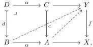

(i) objects are maps $f: Y \to X$ paired with a choice of lifts against all monomorphisms uniformly in all pullback squares:

and

(ii) morphisms $f' \to f$ are commutative squares compatible with the choices of lifts.

Proof. By Proposition 2.2.3 any lifting problem between a monomorphism and a map $f$ factors uniquely as

$$\begin{array}{c c c} C & \xrightarrow {x} Y & C \xrightarrow {x} Y = Y \\ c \Big \downarrow & \Big \downarrow f & c \Big \downarrow \quad \eta_ {f} \Big \downarrow \quad \rho \quad \neg \\ Z & \xrightarrow [ y ]{} X & Z \xrightarrow [ y ]{\zeta^ {x, y}} Y ^ {+ x} \xrightarrow [ f ^ {+} ]{} X \\ & & y \end{array}$$

Thus a relative $+$-algebra structure uniquely equips $f$ with a uniform choice of lifts against all monomorphisms and conversely such lifts specialize to equip $f$ with a relative $+$-algebra structure. Likewise, compatibility of a square $f' \to f$ with chosen lifts against all monomorphisms reduces to compatibility with the retractions $\rho_{f'}$ and $\rho_f$. See [Awo26, 3.7] and [GS17, 9.9(i)].

Definition 2.2.9. Write $\mathcal{TF}$ for the notion of fibred structure on $\mathsf{E}$ obtained by applying Example 2.1.6 with the partial map factorization of Remark 2.2.6. We call $\mathcal{TF}$ the notion of uniform trivial fibration structure.

The $\mathcal{TF}$-algebras are then exactly the relative $+$-algebras, while the $\mathcal{TF}$-morphisms are those pullback squares which are also relative $+$-algebra morphisms. By Proposition 2.2.8, the $\mathcal{TF}$-algebras are equivalently maps equipped with a choice of lifts against all monomorphisms uniformly in pullback squares, and a pullback square $f' \to f$ is a $\mathcal{TF}$-morphism when the chosen lifts against $f'$ are determined by restriction of those against $f$.

Lemma 2.2.10. The notion of fibred structure $\mathcal{TF}$ in an elementary topos is relatively acyclic and locally representable.

Proof. Since, by Remark 2.2.6, the functorial factorization preserves pullbacks and our ambient category is locally cartesian closed, Example 2.1.6 tells us that relative $+$-algebras define a locally representable notion of fibred structure.

The proof of relative acyclicity follows by an adaptation of Shulman's [Shu19, 5.18]. In this setting, relative acyclicity asserts that for any solid-arrow pullback square whose horizontal maps are monomorphisms and vertical maps are relative $+$-algebras as below-left, the relative $+$-algebra structures encoded by the dashed maps below-right can be made to commute by changing the relative $+$-algebra structure for $f$:

$$\begin{array}{c c} Y ^ {\prime} \xrightarrow {i ^ {\prime}} Y & Y ^ {\prime} \xrightarrow [ j ]{\neg i ^ {\prime}} Y \\ f ^ {\prime} \Big \downarrow \quad \neg \quad \Big \downarrow f & \eta_ {f ^ {\prime}} \Big \downarrow \quad \rho_ {f ^ {\prime}} \Big \downarrow \eta_ {f} \\ X ^ {\prime} \xrightarrow [ i ]{} X & Y ^ {\prime + x ^ {\prime}} \xrightarrow [ j ]{} Y ^ {+ x} \\ & f ^ {\prime +} \Big \downarrow \quad \neg \quad \Big \downarrow f ^ {+} \\ & X ^ {\prime} \xrightarrow [ i ]{} X. \end{array}$$

20