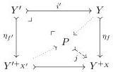
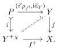
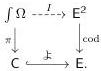
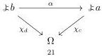

Since the functorial factorization of Remark 2.2.6 is cartesian, the pushout below-left constructs the union of subobjects over $Y^{+x}$ and thus defines a monomorphism:

Since $f$ is a relative $+$-algebra, the resulting lifting problem admits a solution, defining a new relative $+$-algebra structure for $f$ that defines a $\mathcal{TF}$-morphism with the relative $+$-algebra structure for $f'$. $\square$

When we forget structure and consider class of maps underlying $\mathcal{TF}$, we find another equivalent characterization.

**Proposition 2.2.11.** *The following are equivalent for a map $f: Y \to X$ in an elementary topos $\mathsf{E}$:*

- (i) $f$ is a relative $+$-algebra.
- (ii) $f$ lifts against all monomorphisms, uniformly in all pullback squares between monomorphisms.
- (iii) $f$ lifts against all monomorphisms.

*Proof.* The equivalence between (i) and (ii) follows from Proposition 2.2.8. Clearly (ii) implies (iii), and (iii) implies (i) because the diagram (2.2.5) is a lifting problem against a monomorphism. $\square$

**Definition 2.2.12.** We refer to maps $f$ satisfying the equivalent conditions of Proposition 2.2.11 as trivial fibrations.

Internally to $\mathsf{E}$, the relative $+$-algebras can be seen as generated by right lifting against the family $\top: 1 \to \Omega$ indexed by the subobject classifier $\Omega$. In the case where $\mathsf{E}$ is a presheaf topos, this can be externalized as generation by a small *category* of maps. Both of these viewpoints are instances of the framework of Swan [Swa18b] of lifting in a Grothendieck fibration: the codomain fibration for the internal viewpoint and the category-indexed families fibration for the external viewpoint.

**Construction 2.2.13.** Let $\mathsf{E} = \mathsf{Set}^{\mathsf{Cop}}$ be a presheaf topos. In the slice category over $\Omega$, the morphism $\top: 1 \to \Omega$ may be regarded as a subterminal object, determining a family of maps internally indexed by the base object $\Omega$. This family can be externalized to determine a functor $I: \int \Omega \to \mathsf{E}^2$ on the category of elements of $\Omega$, defined by pulling back this internal family to the representables.

The cartesian functor $I$ thus lifts the Yoneda embedding $\nmid$ from the discrete fibration associated to the category of elements of $\Omega$ to the codomain fibration of $\mathsf{E}$:

It sends an element $\chi_c: \nmid a \to \Omega$ to the subobject $C \mapsto \nmid a$ that it classifies, while morphisms in $\int \Omega$

