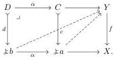

are carried to pullback squares between subobjects as below:

$$\begin{array}{c} D \xrightarrow{\alpha} C \\ \downarrow_{d} \downarrow_{\perp} \quad \downarrow_{c} \\ \updownarrow_{b} \xrightarrow{\alpha} \updownarrow_{a}. \end{array}$$

Recall that for any index category I and functor $I: \mathsf{I} \to \mathsf{E}^2$ into an arrow category, there is a corresponding category $\mathsf{I}^{\square}$ whose objects are arrows of E equipped with chosen lifts against the images of the objects of I, in a way that is natural in the morphisms of I [BG16, 15].

In particular, when $\mathsf{E} = \mathsf{Set}^{\mathsf{Cop}}$ is a presheaf topos, an object of the category $(\int \Omega)^{\square}$ is a morphism $f: Y \to X$ in E equipped with chosen lifts against subobjects of representables that are uniform in pullback squares:

**Proposition 2.2.14.** For $\mathsf{E} = \mathsf{Set}^{\mathsf{Cop}}$ a presheaf topos, the category of relative $+$-algebras is isomorphic over $\mathsf{E}^2$ to $(\int \Omega)^{\square}$.

*Proof.* The statement asserts that in a presheaf topos, the lifting properties of Proposition 2.2.8 reduce to the case where we only ask for lifts against subobjects of representables. See [GS17, 5.16].

*Remark 2.2.15.* In summary, in the setting of a presheaf topos, we have multiple isomorphic characterizations of the category of relative $+$-algebras and the notion of fibred structure $\mathcal{TF}$. Note, however, that these perspectives suggest two non-isomorphic algebraic weak factorization systems providing a functorial factorization of a map into a monomorphism followed by a trivial fibration.

On the one hand, the relative $+$-algebra factorization underlies an awfs as described in Remark 2.2.7. On the other hand, Garner's algebraic small object argument applied to the generating category $I: \int \Omega \to \mathsf{E}^2$ yields an awfs whose category of monad algebras is isomorphic to $(\int \Omega)^{\square}$ [Gar09, 4.4]. By Proposition 2.2.14, the category of monad algebras for the second awfs is thus isomorphic to the category of pointed endofunctor algebras for the first, which is the category of relative $+$-algebras of Definition 2.2.4. In fact, the relative $+$-algebra factorization is the one-step factorization of the algebraic small object argument. See also the discussion in [GS17, 9.5].

### 2.3. Universes.

**Definition 2.3.1.** Fix a notion of fibred structure $\mathfrak{F}$. A **universe** for $\mathfrak{F}$ is an $\mathfrak{F}$-algebra $\pi: \dot{U} \to U$ such that $\pi: \mathsf{E}(-, U) \to \mathfrak{F}$ is an acyclic fibration, meaning that we have bicategorical lifts against Yoneda embeddings of monomorphisms $i: A \mapsto B$ as below:

$$\begin{array}{c} \mathsf{E}(-, A) \xrightarrow{h} \mathsf{E}(-, U) \\ \downarrow_{i} \quad \downarrow_{k} \\ \mathsf{E}(-, B) \xrightarrow{p} \mathfrak{F}. \end{array}$$