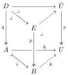
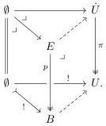

Unpacked, this requires that given any pair of $\mathfrak{F}$-algebras $p, q$ and $\mathfrak{F}$-morphisms as displayed by the solid-arrow squares below, with $i: A \mapsto B$ a monomorphism,

there exists an extension $k$ of $h$ along $i$ factoring the back pullback square as a composite of pullbacks and defining an $\mathfrak{F}$-morphism from $p$ to $\pi$.

**Proposition 2.3.2.** Assume that $\mathsf{E}$ has initial objects which are preserved by pullback along arbitrary maps. Given a relatively acyclic notion of fibred structure $\mathfrak{F}$ with universe $\pi: \dot{U} \to U$, each $\mathfrak{F}$-algebra is a pullback of $\pi$.

*Proof.* Suppose $p: E \to B$ is an $\mathfrak{F}$-algebra. The back pullback square in the diagram below gives the identity on the initial object an $\mathfrak{F}$-algebra structure, and by relative acyclicity, the $\mathfrak{F}$-algebra $p$ can be given an $\mathfrak{F}$-algebra structure making the left-hand pullback into an $\mathfrak{F}$-morphism. Because $\pi: \dot{U} \to U$ is a universe, $p$ is then a pullback of $\pi$:

We now specialize to the setting of a presheaf topos $\mathsf{E} = \mathsf{Set}^{\mathsf{Cop}}$ for some small indexing category $\mathsf{C}$ to give an example of a universe. For any regular cardinal $\kappa$ for which $\mathsf{C}$ is $\kappa$-small, the Hofmann–Streicher construction [HS97; Awo24] provides a classifier $\varpi: \dot{V}_{\kappa} \to V_{\kappa}$ for $\kappa$-small families, i.e., those maps whose components have $\kappa$-small fibres. As noted in Example 2.1.13, for sufficiently large $\kappa$ this defines a locally representable and relatively acyclic full notion of fibred structure $\mathfrak{E}^{\kappa}$. By [Cis14, 3.9], [OP18, 8.4], or [Awo24, 6], the classifier $\varpi: \dot{V}_{\kappa} \to V_{\kappa}$ is a universe for $\mathfrak{E}^{\kappa}$.

Now consider a notion of fibred structure $\mathfrak{F}$ on the presheaf topos $\mathsf{E}$.

**Construction 2.3.3.** If $\mathfrak{F}$ is locally representable, then for sufficiently large $\kappa$ we may define a $\kappa$-small $\mathfrak{F}$-algebra classifier $\pi: \dot{U}_{\kappa} \to U_{\kappa}$ as follows. Firstly, we define a new notion of fibred structure $\mathfrak{F}^{\kappa}$ for which an $\mathfrak{F}^{\kappa}$-algebra is an $\mathfrak{F}$-algebra that is $\kappa$-small. If $\mathfrak{F}$ is locally representable or relatively acyclic, then for $\kappa$ sufficiently large so that Example 2.1.13 holds, $\mathfrak{F}^{\kappa}$ inherits these properties [Shu19, 3.3, 3.11, 4.18, 5.14].

23