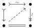
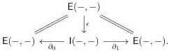

under pushout products in all slices. In §3.4, we introduce the Frobenius condition and mention a few consequences. In §3.5, we connect the equivalence extension property to the univalence axiom in the presence of the Frobenius condition on the cylindrical premodel structure. In §3.6, we use this to establish the fibrancy of the universe, assuming that the fibrations are defined from the trivial fibrations via one of the standard constructions. In §3.7, we translate the fibrancy of the universe into the fibration extension property, which implies that the cylindrical premodel structure is in fact a model structure, retroactively justifying the title of this section as well as the nonstandard encodings of the weak equivalences and the univalence axioms we use along the way.

3.1. Cylindrical premodel structures. Following Barton [Bar19], a premodel structure on a category E is a pair of weak factorization systems, called the (trivial cofibration, fibration) and (cofibration, trivial fibration) weak factorization systems, such that every trivial cofibration is a cofibration (equivalently, any trivial fibration is a fibration). We also require finite limits and colimits (in practice, often only pullbacks along fibrations and pushouts along cofibrations are needed). We denote trivial cofibrations with the arrow $\rightsquigarrow$, fibrations with $\rightarrow$, cofibrations with $\mapsto$, and trivial fibrations with $\rightsquigarrow$.

In a premodel structure, define a map to be a weak equivalence $\rightsquigarrow$ if it factors as a composite of a trivial cofibration followed by a trivial fibration. In particular, the trivial cofibrations and trivial fibrations admit such factorizations, so both of these classes are included in the class of weak equivalences. Conversely, by a standard argument:

Lemma 3.1.1. Any cofibration and weak equivalence is a trivial cofibration, and any fibration and weak equivalence is a trivial fibration.

Proof. The proofs are dual, and standard. If a cofibration factors as a trivial cofibration followed by a trivial fibration, this presents a lifting problem

a solution to which presents the cofibration as a retract of the trivial cofibration.

Thus, from the Joyal–Tierney characterization [JT07, 7.7–7.8] of a (closed) Quillen model structure:

Proposition 3.1.2. A premodel structure defines a model structure if and only if the weak equivalences satisfy the 2-of-3 property.

Remark 3.1.3. Premodel structures lift to slice and coslice categories, with all of the classes of maps created by the forgetful functor to the base category.

For a general premodel structure, the 2-of-3 property for the weak equivalences may be hard to prove (and is often false). A convenient technical device that can be used when present to analyze the weak equivalences in a premodel structure is an adjoint functorial cylinder, introduced below, that satisfies three compatibility conditions making the premodel structure into a cylindrical premodel structure.

Definition 3.1.4. A functorial notion of homotopy on a category E is a reflexive binary relation on the hom-bifunctor in the category of profunctors from E to E:

25