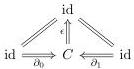
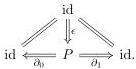

For any pair of objects $A, B \in \mathsf{E}$, we refer to elements of the set $\mathsf{I}(A, B)$ as **homotopies** between maps from $A$ to $B$. More precisely, the fiber over a parallel pair of morphisms $f, g \colon A \rightrightarrows B$

$$\begin{array}{c} \mathsf{I}(A, B)_{(f, g)} \xrightarrow{\quad} \mathsf{I}(A, B) \\ \downarrow \qquad \qquad \qquad \qquad \qquad \qquad \qquad \qquad \qquad \qquad \qquad \qquad \qquad \qquad \qquad \qquad \qquad \qquad \qquad \qquad \qquad \qquad \qquad \qquad \qquad \qquad \qquad \qquad \qquad \qquad \qquad \qquad \qquad \qquad \\ * \xrightarrow{(f, g)} \mathsf{E}(A, B) \times \mathsf{E}(A, B) \end{array}$$

defines the set of **homotopies** from $f$ to $g$. We write $\alpha \colon f \sim g$ to mean that $\alpha \in \mathsf{I}(A, B)_{f, g}$. The map $\epsilon \colon \mathsf{E}(A, B) \to \mathsf{I}(A, B)$ sends each $f \colon A \to B$ to a **constant homotopy** $\epsilon_f \colon f \sim f$.

**Definition 3.1.5.** A functorial notion of homotopy $\mathsf{I}$ on $\mathsf{E}$ is

- **representable** if the profunctor $\mathsf{I}$ is covariantly represented by a functor $P \colon \mathsf{E} \to \mathsf{E}$, which then defines a **functorial cocylinder** $\mathsf{I}(A, B) \cong \mathsf{E}(A, PB)$, and
- **corepresentable** if the profunctor $\mathsf{I}$ is contravariantly represented by a functor $C \colon \mathsf{E} \to \mathsf{E}$, which then defines a **functorial cylinder** $\mathsf{I}(A, B) \cong \mathsf{E}(CA, B)$.

In the co/represented setting, by the profunctorial Yoneda lemma, the natural transformations $(\epsilon, \partial_0, \partial_1)$ determine natural transformations

When $\mathsf{I}$ is **birepresentable**, that is both representable and corepresentable, these functors are adjoints $C \dashv P$ and the natural transformations are conjugates. As in Lemma 2.1.15, we use the same notation for a conjugate pair of transformations, e.g., $\epsilon \colon C \Rightarrow \mathrm{id}$ and $\epsilon \colon \mathrm{id} \Rightarrow P$. We follow [CS25, 3.9] and refer to a birepresentable functorial notion of homotopy as an **adjoint functorial cylinder**.

We now show that all of these notions are stable under slicing—that is, passage to $\mathsf{E}_{/X}$—and coslicing—that is, passage to $^{X}/\mathsf{E}$—over and under arbitrary objects $X \in \mathsf{E}$. In fact it suffices to consider slice categories, since functorial notions of homotopy are self-dual.

**Lemma 3.1.6.** *If $\mathsf{E}$ has a functorial notion of homotopy $\mathsf{I}$ then for any $X \in \mathsf{E}$ the slice category $\mathsf{E}_{/X}$ has a functorial notion of homotopy $\mathsf{I}_X$. Moreover:*

(i) if $\mathsf{I}$ is corepresentable, then so is $\mathsf{I}_X$, and
(ii) if $\mathsf{I}$ is representable and $\mathsf{E}$ has pullbacks then so is $\mathsf{I}_X$.

*Proof.* We leave the general case to the reader and construct the functorial cylinder and cocylinder in the birepresentable case.

Given an object $g \colon Y \to X$ in the slice $\mathsf{E}_{/X}$ its **fibred cylinder factorization** is created by the forgetful functor to $\mathsf{E}$, with the projections to $X$ defined by composing in the diagram

$$\begin{array}{c} Y + Y \xrightarrow{(\partial_0, \partial_1)} CY \xrightarrow{\epsilon} Y \\ f + f \downarrow \qquad \qquad \qquad \qquad \qquad \qquad \qquad \qquad \qquad \qquad \qquad \qquad \qquad \qquad \qquad \qquad \qquad \qquad \qquad \qquad \qquad \qquad \qquad \qquad \qquad \qquad \qquad \qquad \qquad \qquad \qquad \qquad \qquad \qquad \\ X + X \xrightarrow{(\partial_0, \partial_1)} CX \xrightarrow{\epsilon} X. \end{array}$$

26