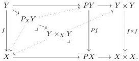
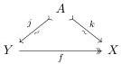
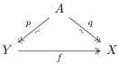

Meanwhile, the fibred cocylinder factorization is constructed as follows:

Remark 3.1.7. Definitions 3.1.4 and 3.1.5 are self-dual, so in particular the dual of Lemma 3.1.6 applies to coslice categories $X/E$.

Let I be a birepresented notion of homotopy on a category E with finite limits and colimits. Write $\partial: \mathrm{id} + \mathrm{id} \Rightarrow C$ and $\partial: P \Rightarrow \mathrm{id} \times \mathrm{id}$ for the conjugate pair of natural transformations with components defined by $\partial_0$ and $\partial_1$. The notion of a cylindrical premodel structure makes use of the Leibniz applications introduced in Definition 2.1.14.

Definition 3.1.8. A premodel structure on E is cylindrical if E admits an adjoint functorial cylinder so that:

- (i) Leibniz pullback application of $\partial: P \Rightarrow \mathrm{id} \times \mathrm{id}$ preserves fibrations and trivial fibrations.
- (ii) Leibniz pullback application of $\partial_0: P \Rightarrow \mathrm{id}$ and $\partial_1: P \Rightarrow \mathrm{id}$ sends fibrations to trivial fibrations.

By Lemma 2.1.15 these conditions could be phrased dually in terms of Leibniz pushout application of the conjugate natural transformations. As observed in [CS25, 3.2, 3.11, 3.17]:

Lemma 3.1.9. A cylindrical premodel structure on E induces a cylindrical premodel structure on each of its coslice and slice categories.

Proof. We prove the case of slice categories, the coslices being dual. By Lemma 2.1.15, it suffices to show that Leibniz pushout application of $\partial: \mathrm{id} + \mathrm{id} \Rightarrow C$ preserves cofibrations and trivial cofibrations and Leibniz pushout application of $\partial_0, \partial_1: \mathrm{id} \Rightarrow C$ send cofibrations to trivial cofibrations. But both these classes and these constructions are created by the forgetful functor to E and E is cylindrical, so this is immediate. □

The cylindrical premodel structure axioms allow us to deduce various “2-of-3-like” properties of “acyclic” morphisms without relying on the 2-of-3 property for the weak equivalences. Two such results are the following.

Lemma 3.1.10 ([CS25, 3.19–20, 3.27]). In a cylindrical premodel structure, in any diagram of the form below-left, the fibration is a trivial fibration,

and if the trivial fibrations are detected by lifting against cofibrations between cofibrant objects, the same is true in any diagram of the form above-right.

The first statement is proven by exhibiting $f$ as a retract of a trivial fibration constructed using axiom 3.1.8(ii) in a retract diagram whose data is defined by lifting. The second statement holds more generally even when $f$ is not known to be a fibration, by an elementary lifting argument.

27