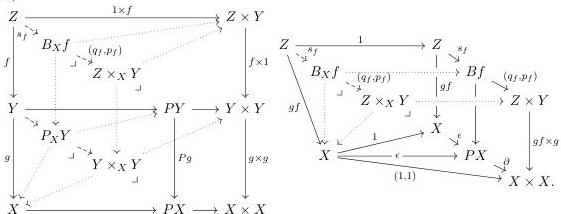
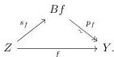

displayed below-left:

(3.2.4)

By interchange of the pullback constructing the Brown factorization with pullback to the slice over $X$, the fibred Brown factorization is a pullback of the non-fibred Brown factorization as indicated in the right diagram above. Here the right-hand rectangle is formed by applying the non-fibred Brown factorization to the commutative square from $f$ to the identity on $X$.

In this setting, Lemma 3.2.2 specializes to tell us that

- (i) when $g$ is a fibration, $(q_f, p_f) \colon B_X f \to Z \times_X Y$ is a fibration,
- (ii) when $g$ is a fibration, $q_f \colon B_X f \to Z$ is a trivial fibration,
- (iii) when $g$ and $gf$ are both fibrations, $p_f \colon B_X f \to Y$ is a fibration.

**Lemma 3.2.5.** *The fibred Brown factorization is stable under all pullbacks.*

*Proof.* This is the combination of the description of the fibred Brown factorization in the right-hand diagram of (3.2.4) with pullback pasting. $\square$

**Definition 3.2.6.** A map $f \colon Z \to Y$ between fibrant objects in a cylindrical premodel category is called **contractible** when the right factor $p_f \colon B_f \to Y$ in its Brown factorization is a trivial fibration:

In the presence of the 2-of-3 property, the contractible maps agree with the weak equivalences between fibrant objects:

**Lemma 3.2.7.** *In a cylindrical model category, where the weak equivalences satisfy the 2-of-3 property, a map between fibrant objects is contractible if and only if it is a weak equivalence.*

*Proof.* If the weak equivalences satisfy the 2-of-3 property, then the section $s_f$ of the trivial fibration $q_f$ is also a weak equivalence. Thus, again by 2-of-3, $f$ is a weak equivalence if and only if the fibration $p_f$ is a trivial fibration. $\square$

For emphasis, we shall refer to a contractible map in a slice $\mathsf{E}_{/X}$ as a **contractible map over $X$**. Explicitly, a fibred map $f \colon Z \to Y$ over $X$ is contractible just when its domain $Z \to X$ and codomain $Y \to X$ are fibrations, and the fibration $p_f \colon B_X f \to Y$ of Remark 3.2.3 is a trivial fibration.

29