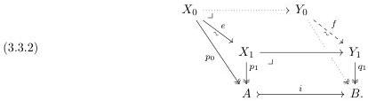

3.3. **Equivalence extension property.** In this section, we show that under suitable hypotheses, a cylindrical premodel category satisfies the following condition, the significance of which is explained in the sequel.

**Definition 3.3.1.** A cylindrical premodel structure has the **equivalence extension property** when any contractible map $e$ over an object $A$ can be extended along any cofibration $i: A \mapsto B$ to a contractible map $f$ over $B$ with a specified codomain extending that of the original map:

In a setting such as a presheaf topos where we have universe levels, there is an additional requirement: for sufficiently large inaccessible cardinals $\kappa$, if $p_0$, $p_1$, and $q_1$ are $\kappa$-small, so is the extended fibration in (3.3.2).

**Theorem 3.3.3.** *Let $\mathsf{E}$ be a locally cartesian closed category with a cylindrical premodel structure in which the cofibrations are the monomorphisms, and these are stable under pushout-products in all slices. Then the equivalence extension property holds in $\mathsf{E}$.*

**Example 3.3.4.** For instance, by Remark 2.2.2, the hypotheses are satisfied in a cylindrical premodel structure on an elementary topos if the cofibrations are the monomorphisms. Moreover, in a presheaf topos, all of the constructions in the proof of Theorem 3.3.3 will respect universe levels.

Our approach to the equivalence extension property phrased using contractible maps follows [Sat17]. In a cylindrical model category, where the weak equivalences satisfy the 2-of-3 condition, this is equivalent by Lemma 3.2.7 to the equivalence extension property phrased instead using weak equivalences as in [KL21; Shu15].

The proof of Theorem 3.3.3 occupies the remainder of this section. To begin, in the diagram (3.3.2), we have $i^*Y_1 \cong X_1$ by hypothesis, and we define an object $Y_0$ with a map $f: Y_0 \to Y_1$ as a pullback of the pushforward along $i$ of the given fibred map $e: X_0 \to X_1$:

$$\begin{array}{c} Y_0 \xrightarrow{\eta_{Y_0}} i_* X_0 \\ f \downarrow \quad \downarrow i_* e \\ Y_1 \xrightarrow{\eta_{Y_1}} i_* i^* Y_1. \end{array} \tag{3.3.5}$$

By Lemma 2.2.1, $i^*\eta_{Y_1}$ is invertible. Considering the image of (3.3.5) under the pullback-preserving functor $i^*$, we conclude that $i^*f$ is isomorphic to $i^*i_*e \cong e$. In other words, $f: Y_0 \to Y_1$ pulls back along $i$ to the original map $e: X_0 \to X_1$, giving a diagram of the required form (3.3.2).

It remains to show that $q_1 f: Y_0 \to B$ is a fibration and that $f: Y_0 \to Y_1$ is a contractible map over $B$. We shall prove both in the slice over $B$.

30