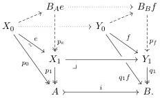
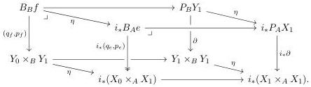
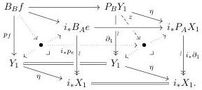

For contractibility, consider the fibred Brown factorizations for both $e$ and $f$:

By Lemma 3.2.5, the fibred Brown factorization for $f$ pulls back along $i$ to the factorization for $e$, and similarly the fibred path objects pullback $i^*P_BY_1 \cong P_AX_1$ (not shown in the diagram). The relationship between the pushforward of the fibred Brown factorization for $e$ and that for $f$ is more complicated, however. To understand it, first consider the naturality cube resulting from the pullback square defining the map $(q_f, p_f)$ and the unit natural transformation $\eta: \mathrm{id} \Rightarrow i_*i^*$, which by Lemma 3.2.5 determines the following commutative cube:

The back face is the pullback in Construction 3.2.1, and the front face is its image under the right adjoint $i_*$, and is therefore also a pullback. Since (3.3.5) is a pullback, the bottom square is one as well. By pullback composition and cancelation, the top square is therefore also a pullback.

Now consider the naturality cube associated to the commutative square relating $p_f$ and $\partial_1$:

The top square was just shown to be a pullback, and the bottom square is evidently one. So when we form the pullbacks indicated in the left and right faces, we obtain a factorization of $p_f$ as a pullback of the map $i_*p_e$, after a pullback of the comparison map $z$ indicated as a dashed arrow in the right-hand face. This factorization will display $p_f$ as a trivial fibration, as we now argue.

First, since $e$ is a contractible map over $A$, its second Brown factor $p_e$ is a trivial fibration. Since the cofibrations are the monomorphisms, and therefore stable under pullback, the trivial fibrations are stable under pushforward, and so $i_*p_e$ is a trivial fibration, as is any pullback of it.

Next, the map $z$ may be described as a Leibniz pullback application of the unit $\eta$ applied to the trivial fibration $\partial_1: P_BY_1 \xrightarrow{\sim} Y_1$. But this is also a trivial fibration, as it is the Leibniz exponential, in the slice over $B$, of the cofibrant object $i: A \mapsto B$ and the trivial fibration $\partial_1: P_BY_1 \xrightarrow{\sim} Y_1$, and monomorphisms are closed under pushout-products in slices.

31