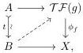
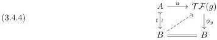
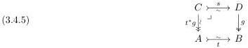
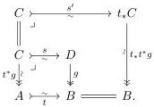
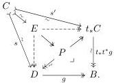

Proof. To solve a lifting problem of the form

we can equivalently solve the induced lifting problem against the pullback of $\phi_f$ along $B \to X$. By pullback stability of the fibrations and Lemma 2.1.4(ii), it thus suffices to solve lifting problems of the form

where $t: A \xrightarrow{\sim} B$ is a trivial cofibration and $g: D \to B$ is a fibration. This amounts to showing that if the fibration $g$ becomes a $\mathcal{TF}$-algebra upon pulling back along $t$, then it has a $\mathcal{TF}$-algebra structure making the pullback square

into a $\mathcal{TF}$-morphism. Note that by the Frobenius condition, the map $s$ in this pullback square is also a trivial cofibration, as a pullback of the trivial cofibration $t$ along the fibration $g$.

Since $t^*g$ is a trivial fibration by assumption, the pushforward $t_*t^*g: t_*C \to B$ is also a trivial fibration. Since $t$ is monic, Lemma 2.2.1 implies that $t_*t^*g$ pulls back along $t$ to $t^*g$:

Again since $t_*t^*g$ is a (trivial) fibration, the pullback $s'$ is also a trivial cofibration, by the Frobenius condition. We therefore have a (trivial cofibration, fibration) and a (trivial cofibration, trivial fibration) factorization of a common map $g \cdot s = t_*t^*g \cdot s'$. In a cylindrical premodel structure, it follows that the fibration $g$ is a trivial fibration, by an argument we now reprise.

In the commutative square defined by the pair of factorizations, form the pullback $P$ and factor the gap map in the square as a trivial cofibration followed by a fibration:

33