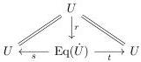

Lemma 3.5.1. In a locally cartesian closed category with a cylindrical premodel structure satisfying the Frobenius condition, any fibration \(\pi: \dot{U} \twoheadrightarrow U\) has a factorization

of the diagonal \(U\to U\times U\) such that

(i) \((s,t)\colon \operatorname {Eq}(\dot{U})\twoheadrightarrow U\times U\) is a fibration and
(ii) the pullback of \(\operatorname{Eq}(\dot{U}) \twoheadrightarrow U \times U\) along any \(e: \Gamma \to U \times U\) classifies (structured) contractible maps over \(\Gamma\) between pullbacks of \(p: \dot{U} \twoheadrightarrow U\).

Under the stated hypotheses, the construction is the one due to Voevodsky, described, for instance, in [Shu15, §4] and involves his classifier for contractible maps. As discussed in Digression 3.4.6, we can prove Lemma 3.5.1 using any locally representable and relatively acyclic notion of fibred structure for trivial fibrations.

Proof of Lemma 3.5.1. We construct \(\operatorname{Eq}(\dot{U}) \twoheadrightarrow U \times U\) by first forming the pullbacks on the left below, and then the internal hom between them in the slice over \(U \times U\), as shown on the right:

\[
\begin{array}{c} \dot {U} \times U \longrightarrow \dot {U} \longleftarrow U \times \dot {U} \\ \pi_ {1} ^ {*} \pi \Biggl \downarrow \quad \text {   } \quad \Biggl \downarrow \pi \quad \text {   } \quad \Biggl \downarrow \pi_ {2} ^ {*} \pi \\ U \times U \xrightarrow [ \pi_ {1} ]{} U \xleftarrow [ \pi_ {2} ]{} U \times U \end{array}
\]

\[
\begin{array}{c} \operatorname{Map} _ {U \times U} (\pi_ {1} ^ {*} \dot {U}, \pi_ {2} ^ {*} \dot {U}) \\ \Big \downarrow [ \pi_ {1} ^ {*} \pi , \pi_ {2} ^ {*} \pi ] _ {U \times U} \\ U \times U. \end{array}
\]

By the Frobenius condition, this map is a fibration. The counit \(\epsilon\colon\mathrm{Map}_{U\times U}(\pi_{1}^{*}\dot{U},\pi_{2}^{*}\dot{U})\times_{U\times U}\pi_{1}^{*}\dot{U}\to\pi_{2}^{*}\dot{U}\) equivalently defines a map

\[
\epsilon \colon \operatorname{Map} _ {U \times U} (\pi_ {1} ^ {*} \dot {U}, \pi_ {2} ^ {*} \dot {U}) \times_ {U \times U} \dot {U} \times U \to \operatorname{Map} _ {U \times U} (\pi_ {1} ^ {*} \dot {U}, \pi_ {2} ^ {*} \dot {U}) \times_ {U \times U} U \times \dot {U}
\]

over \(\mathrm{Map}_{U\times U}(\pi_1^*\dot{U},\pi_2^*\dot{U})\), which is the universal map between two pullbacks of \(\pi\), i.e. small fibrations.

We define \(\mathrm{Eq}(\dot{U})\) by equipping this \(\epsilon\) with the data of a contractible map over \(\mathrm{Map}_{U\times U}(\pi_1^*\dot{U},\pi_2^*\dot{U})\), by taking the classifier \(\phi_{p_\epsilon}\colon \mathcal{T}\mathcal{F}(p_\epsilon)\to \mathrm{Map}_{U\times U}(\pi_1^*\dot{U},\pi_2^*\dot{U})\times_{U\times U}\pi_2^*\dot{U}\) for trivial fibration structures on the right Brown factor \(p_\epsilon \colon B_{\mathrm{Map}_U(\pi_1^*\dot{U},\pi_2^*\dot{U})}\epsilon \twoheadrightarrow \mathrm{Map}_{p_\epsilon}(\pi_1^*\dot{U},\pi_2^*\dot{U})\times_{U\times U}\pi_2^*\dot{U}\), pushing it forward to obtain an object over \(\mathrm{Map}_{U\times U}(\pi_1^*\dot{U},\pi_2^*\dot{U})\), and then summing to obtain one over \(U\times U\).

The resulting map \(\operatorname{Eq}(\dot{U}) \to U \times U\) would thus be written in type theory as:

\[
\operatorname{Eq} (\dot {U}) = \Sigma_ {A, B: U} \Sigma_ {f: A \to B} \Pi_ {b: B} \mathcal {T F} (\operatorname{fib} _ {f} (b)) \to U \times U.
\]

It is easily seen to have the stated classifying property (ii). It is a fibration as required by (i) provided that the map \(\phi_{p_{\epsilon}}\colon \mathcal{T}\mathcal{F}(p_{\epsilon})\to \mathrm{Map}_{U\times U}(\pi_1^*\dot{U},\pi_2^*\dot{U})\times_{U\times U}\pi_2^*\dot{U}\) is one. But this follows from Lemma 3.4.3, since \(\mathrm{fib}_f(b)\) is just the right Brown factor \(p_{\epsilon}\colon B_{\mathrm{Map}_U(\pi_1^*\dot{U},\pi_2^*\dot{U})}\epsilon \twoheadrightarrow \mathrm{Map}_{p_{\epsilon}}(\pi_1^*\dot{U},\pi_2^*\dot{U})\times_{U\times U}\pi_2^*\dot{U}\), which is a fibration by Remark 3.2.3.

By the construction just given, the fibration \((s,t)\colon \operatorname {Eq}(\dot{U})\twoheadrightarrow U\times U\) factors as follows:

\[
\operatorname{Eq} (\dot {U}) \xrightarrow [ (s , t) ]{v} \operatorname{Map} _ {U \times U} (\pi_ {1} ^ {*} \dot {U}, \pi_ {2} ^ {*} \dot {U}) ^ {\left[ \pi_ {1} ^ {*} \pi , \pi_ {2} ^ {*} \pi \right] _ {U \times U}} U \times U.
\]

The contractible map classifier just constructed satisfies a relative version of the relative acyclicity property of the following form inherited from relative acyclicity for \(\mathcal{T}\mathcal{F}\).

35