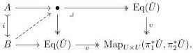
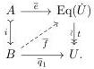

**Lemma 3.5.2.** In a locally cartesian closed category with a cylindrical premodel structure satisfying the Frobenius condition, contractible map structures defined using a locally representable and relatively acyclic notion of fibred structure $\mathcal{TF}$ for trivial fibrations can be aligned along monomorphisms, in the sense that the kernel pair projections lift against monomorphisms:

Proof. By construction, the map $\upsilon$ is the pushforward of the classifier

$$\phi_{p_\epsilon} \colon \mathcal{TF}(p_\epsilon) \to \mathrm{Map}_{U \times U}(\pi_1^* \dot{U}, \pi_2^* \dot{U}) \times_{U \times U} \pi_2^* \dot{U}$$

for trivial fibration structures. Since the notion of fibred structure $\mathcal{TF}$ is locally representable and relatively acyclic, by Lemma 2.1.12 the maps in the kernel pair of $\phi_{p_\epsilon}$ lift against monomorphisms. Since monomorphisms are stable under pullback, this condition is stable under pushforward. $\square$

The construction of Lemma 3.5.1 allows us to codify univalence as follows.

**Definition 3.5.3.** A fibration $\pi \colon \dot{U} \twoheadrightarrow U$ is **univalent** if the map $t \colon \mathrm{Eq}(\dot{U}) \twoheadrightarrow U$ is a trivial fibration.

Remark 3.5.4. Definition 3.5.3 connects to the standard homotopy type theoretic encoding of the univalence axiom as follows. By Lemma 3.5.1, the diagonal on $U$ lifts through a map $\mathrm{id} \colon U \to \mathrm{Eq}(\dot{U})$, classifying the identity map. This factorization of the diagonal can be related to the canonical one of the cocylinder by a map $u$, as indicated below:

$$\begin{array}{c} U \xrightarrow{\mathrm{id}} \mathrm{Eq}(\dot{U}) \\ \downarrow_{\epsilon} \quad \quad \quad \quad \quad \quad \quad \quad \quad \quad \quad \quad \quad \quad \quad \quad \quad \quad \quad \quad \quad \quad \quad \quad \quad \quad \quad \quad \quad \quad \quad \quad \quad \quad \quad \quad \quad \quad \quad \quad \quad \quad \quad \quad \quad \quad \quad \quad \quad \quad \text{(s,t)} \\ PU \xrightarrow{\partial} U \times U. \end{array}$$

If the base of the universe is fibrant, as will be proven under mild hypotheses in §3.6 below, the map $\partial_1 \colon PU \xrightarrow{\sim} U$ will be a trivial fibration, so in the presence of the 2-of-3 axiom, $t$ is a trivial fibration if and only if $u$ is a weak equivalence.

**Proposition 3.5.5.** Consider a cylindrical premodel structure on a presheaf topos satisfying the Frobenius condition in which the cofibrations are the monomorphisms. If the premodel structure has universes in the sense of Definition 2.3.6, the equivalence extension property holds if and only if each universe $\pi \colon \dot{U} \twoheadrightarrow U$ is univalent.

Proof. To prove the equivalence extension property assuming univalence, choose a univalent universe sufficiently large to classify the data in (3.3.2) by means of a lifting problem

For this, we first choose classifying maps $\overline{p}_0 \colon A \to U$ for $p_0$ and $\overline{q}_1 \colon B \to U$ and then use Lemma 3.5.1 to extend the map $(\overline{p}_0, \overline{q}_1 i) \colon A \to U \times U$ to a map $\overline{e} \colon A \to \mathrm{Eq}(\dot{U})$ classifying the contractible map $e$. By univalence, $t$ is a trivial fibration, so this lifting problem has a solution $\overline{f}$, which classifies a contractible map $f$ that pulls back along $i$ to $e$.

36