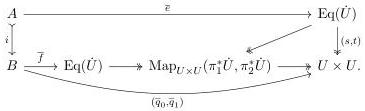
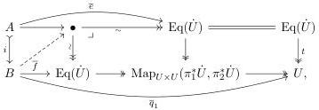
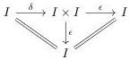

For the converse, consider a lifting problem as above, and suppose the equivalence extension property holds. By Lemma 3.5.1, the map $\overline{e}$ classifies a contractible map $e$ between fibrations into $A$ as in (3.3.2), while $\overline{q}_1$ classifies a fibration $q_1$ into $B$ that pulls back along $i$ to the codomain of $e$. By the equivalence extension property, the equivalence extends to an equivalence $f$ over $B$ with codomain $q_1$ at the same universe level. Using the given universe and relative acyclicity of its associated notion of fibred structure, we obtain a classifying map $\overline{q}_1$ for $q_1$ so that the exterior rectangle of classifying maps commutes:

In fact, by the universal property of the fibration $[\pi_1^*\pi, \pi_2^*\pi]_{U\times U} \colon \mathrm{Map}_{U\times U}(\pi_1^*\dot{U}, \pi_2^*\dot{U}) \twoheadrightarrow U\times U$ and commutativity the diagram (3.3.2), the interior of the diagram commutes as well. Thus, our original lifting problem factors as displayed below:

and can be solved by Lemma 3.5.2, which aligns the equivalence structure on $f$ with that of $e$. $\square$

3.6. **Fibrant universes.** We next introduce an axiomatic setup that allows us to use Proposition 3.5.5 to infer that the universes $\pi \colon \dot{U} \to U$ of fibrations have fibrant base objects $U$. Our argument follows that in [ABCHFL21, 2.12].

Suppose that $\mathsf{E}$ has a (cofibration, trivial fibration) weak factorization system in which every object is cofibrant, and let $P \colon \mathsf{E} \to \mathsf{E}$ be a finite-product preserving endofunctor equipped with a natural retraction, i.e. $\epsilon \colon \mathrm{id} \Rightarrow P$ and $\delta \colon P \Rightarrow \mathrm{id}$ such that $\delta \cdot \epsilon = \mathrm{id}$. For instance, $P$ could be the cocylinder part of an adjoint functorial cylinder with $\delta$ taken to be either $\partial_0$ or $\partial_1$. Alternately:

**Example 3.6.1.** For any object $I$ in a cartesian closed category $\mathsf{E}$, we have a diagram in the slice $\mathsf{E}_{/I}$

expressing the terminal object as a retract of $I$ pulled back to the slice. Here $\delta$ is the diagonal map and $\epsilon$ is the product projection obtained by pulling back $I \to 1$ to the slice. Exponentiating by these objects defines an endofunctor $P \colon \mathsf{E}_{/I} \to \mathsf{E}_{/I}$ together with natural transformations $\epsilon \colon \mathrm{id} \Rightarrow P$ and $\delta \colon P \Rightarrow \mathrm{id}$ such that $\delta \cdot \epsilon = \mathrm{id}$.

37