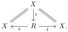
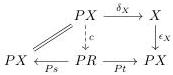
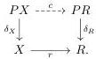
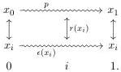
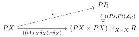
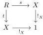

By a reflexive relation $R \rightrightarrows X$ on an object $X$ we mean a factorization of the diagonal:

Note that we do not require the canonical pairing $(s, t) \colon R \to X \times X$ to be monic.

Definition 3.6.2. A $\delta$-contractor for a reflexive relation $R \rightrightarrows X$ is a map $c \colon PX \to PR$ making the following diagrams commute:

Remark 3.6.3. To gain some intuition for this definition, suppose we are in a topological setting and $PX = X^I$ is the path space functor, $\epsilon$ the constant path operation, and $\delta$ evaluates a path at some fixed point $i \in I$. A $\delta$-contractor $c$ takes a path $p \colon x_0 \rightsquigarrow x_1$ in $X$ and produces a square as shown below, where the horizontal arrows are paths, the vertical arrows are witnesses to the relation $R$, and $x_i$ is the value of $p$ at $i$:

The first diagram in Definition 3.6.2 determines the horizontal arrows: it asks that $c$ is a path of witnesses relating $p$ to the constant path $\epsilon(x_i)$. The second diagram asks that the value of $c$ at $i$, which relates $x_i$ to itself, is the reflexivity for $R$.

Lemma 3.6.4. Let $R \rightrightarrows X$ be a reflexive relation. If the Leibniz pullback application of $\delta$ to $(s, t) \colon R \to X \times X$ is a trivial fibration, then $R$ has a $\delta$-contractor.

Proof. The required diagrams from 3.6.2 can be repackaged into a single lifting problem as follows:

But the vertical map is the said Leibniz pullback application $\delta \circ (s, t)$, which is assumed to be a trivial fibration, and so there is the indicated lift $c$, since all objects are cofibrant. $\square$

Lemma 3.6.5. Let $R \rightrightarrows X$ be a reflexive relation with a $\delta$-contractor. Consider the square

as a morphism $t \to !_X$ in $\mathsf{E}^2$. The image of this morphism under the Leibniz pullback application functor $\delta \circ - \colon \mathsf{E}^2 \to \mathsf{E}^2$ is a split epimorphism.

38