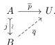

Conversely, suppose the fibration extension property holds and consider a lifting problem into the base of one of the universal fibrations:

Define a fibration $p: X \rightarrow A$ by pulling back $\pi$ along $\bar{p}$. Then use the fibration extension property to extend this to a fibration $q: Y \rightarrow B$ that pulls back along $j$ to $p$. As required by Definition 3.7.1, this extended fibration is classified by the same universe. Using the given universe and relative acyclicity of its associated notion of fibred structure, the classifying map $\bar{p}$ extends along $j$ to a classifying map $\bar{q}$ for $q$ so that $\bar{q} \cdot j = \bar{p}$, solving the lifting problem. This proves that the fibration extension property implies fibrancy of the universe. $\square$

We can now make use of the following result from [CS25], the proof of which is entirely axiomatic.

**Proposition 3.7.3** ([CS25, 3.31]). *Let $\mathsf{E}$ be a cylindrical premodel category in which all objects are cofibrant. If the fibration extension property holds, then the weak equivalences satisfy the 2-of-3 condition.*

Thus, the constructions of a model of homotopy type theory and of a Quillen model structure from a cylindrical premodel category with all objects cofibrant are intertwined. First one checks the equivalence extension property, which is the heart of the interpretation of univalence. Then one proves the Frobenius condition, which provides the interpretation of $\Pi$-types and is connected to right properness of the model structure. The equivalence extension property and Frobenius condition may then also play a role in the construction of fibrant universes. Besides interpreting the universes of the type theory, the fibrant universes can be used to derive the fibration extension property, which then yields the model structure. In the sequel, we see two versions of this story, both showing that a cylindrical premodel structure is a model structure, first in cubical species and then in cubical sets.

#### 4. THE INTERVAL MODEL STRUCTURE ON CUBICAL SPECIES

On a presheaf topos with a suitable interval object there is a now well-known strategy for defining a model structure that models homotopy type theory. The cofibrations are the monomorphisms, making the trivial fibrations those of Definition 2.2.12. The fibrations are then defined from the trivial fibrations as either the *biased* or *unbiased* fibrations of Definition 3.6.7.$^9$ The results in the previous section then apply to establish the equivalence extension property, the Frobenius condition, the fibration extension property, the univalence and fibrancy of the universes, and verify the 2-of-3 condition for the weak equivalences.

Here we apply this outline not in the category of cubical sets but in the category of *cubical species* introduced in §4.2, which has a suitable “symmetric” interval object. The category of cubical species is a category of groupoid-indexed functors valued in cubical sets, so in §4.1 we first discuss some general results about subobject classifiers, pushforwards, and tiny objects that apply in that general setting. In §4.3, we establish the cylindrical premodel structure on cubical species. Then in §4.4, we apply the results from §3 to prove that this premodel structure is a model structure modeling homotopy type theory.

$^9$As noted in [CS25, 4.22–23] and Proposition 6.1.7, sometimes these classes coincide.

41