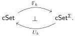

4.2. Cubical species and the symmetric interval. The “cubical” in the phrase cubical species refers to the cartesian cube category, defined below. In Buchholtz and Morehouse’s taxonomy of cube categories [BM17], this is $\mathbb{C}_{(\mathrm{wec},\cdot)}$.

Definition 4.2.1. The cartesian cube category $\square := \mathsf{Fin}_{\perp \neq \top}^{\mathrm{op}}$ is the opposite of the category of finite strictly bipointed sets and bipointed maps. Its objects are bipointed sets of the form $\{\bot, 1, \dots, n, \top\}$ for $n \geq 0$. We write $\mathsf{cSet} := \widehat{\square}$ for the topos of presheaves and call its objects (cartesian) cubical sets. Under the Yoneda embedding $\bot: \square \to \mathsf{cSet}$, the object $\{\bot, 1, \dots, n, \top\}$ is identified with the $n$-cube $I^n$. By the Yoneda lemma, morphisms $\alpha: I^m \to I^n$ correspond to functions $\alpha: \{\bot, 1, \dots, n, \top\} \to \{\bot, 1, \dots, m, \top\}$ preserving the basepoints $\bot$ and $\top$.

Let $\Sigma \cong \coprod_{k \geq 1} \Sigma_k$ be the maximal subgroupoid of the cube category $\square$ excluding, for reasons explained in Remark 4.3.17, the identity automorphism of the 0-cube. Here $\Sigma_k$ is the one-object groupoid associated to the symmetric group $\Sigma_k$, which acts on $\{\bot, 1, \dots, k, \top\}$ by permuting the indices and thus acts on the representable cubical set $I^k$ by permuting the dimensions.

Definition 4.2.2. A cubical species is a set-valued functor on $\square^{\mathrm{op}} \times \Sigma$.

It is convenient to represent a cubical species as a symmetric sequence of cubical sets, i.e., as a family $\mathbb{X} = (X^k)_{k \geq 1}$ of cubical sets, in which each $X^k$ has a specified $\Sigma_k$-action. Indeed, as a category we have

$$\mathsf{Set}^{\square^{\mathrm{op}} \times \Sigma} \cong \mathsf{cSet}^{\Sigma} \cong \prod_{k \geq 1} \mathsf{cSet}^{\Sigma_k}.$$

A cubical species that is non-empty in only a single factor $\mathsf{cSet}^{\Sigma_k}$ is said to be concentrated in degree $k$.

Write $\mathbb{F}_k: \mathsf{cSet} \to \mathsf{cSet}^{\Sigma}$ for left Kan extension along $*_k: \mathbb{1} \to \Sigma$, the left adjoint to the functor $U_k: \mathsf{cSet}^{\Sigma} \to \mathsf{cSet}$ which projects to the $k$th component of the cubical species and forgets the action:

Definition 4.2.3. For $k \geq 1$, a $k$-free cubical species is a cubical species of the form $\mathbb{F}_k X$ for $X \in \mathsf{cSet}$. Explicitly, the $k$-free cubical species $\mathbb{F}_k X$ is concentrated in degree $k$ with free $\Sigma_k$-action on the cubical set $X \times \Sigma_k$.

We highlight two particularly important examples of cubical species.

Example 4.2.4. The representable cubical species

$$\hom_{\square \times \Sigma^{\mathrm{op}}} \bigl(-, ([n], *_k)\bigr),$$

represented by the pair of objects $[n] = \{\bot, 1, \dots, n, \top\} \in \square$ and $*_k \in \Sigma$, is the free cubical species $\mathbb{F}_k I^n$ concentrated in degree $k$ and given there by the cubical set $I^n \times \Sigma_k$ with the free $\Sigma_k$-action.

Example 4.2.5. The restriction of the hom bifunctor $\hom \in \mathsf{Set}^{\square^{\mathrm{op}} \times \square}$ along the inclusion $\Sigma \hookrightarrow \square$ in the codomain variable defines a cubical species $\mathbb{I}$ whose $k$th component is the geometric $k$-cube $I^k$ with its regular action, permuting the $k$ dimensions.

Remark 4.2.6. The symmetric interval $\mathbb{I}$ has $2^\omega$ points $\mathbb{1} \to \mathbb{I}$: for any countable sequence $\vec{v}$ of 0s and 1s there is a corresponding point $\vec{v}: \mathbb{1} \to \mathbb{I}$ that chooses either the initial or final vertex in each component. Since the terminal cubical species $\mathbb{1}$ has a trivial action in each component, all points of the interval are fixed points for the coordinatewise actions of the symmetric groups.

43