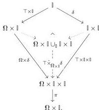

indexed by the object $\Omega \times \mathbb{I}$:

Our category of generating trivial cofibrations will be given by externalizing the family $\top \hat{\times}_{\Omega \times \mathbb{I}} \delta$ and will therefore be indexed by the category of elements of $\Omega \times \mathbb{I}$.

*Remark 4.3.4.* Since in general $\int_{\mathbb{X}} 1 \cong \mathbb{X}$, and the category of elements functor $\int$ preserves pullbacks, the category of elements of a product is the pullback of the categories of elements:

$$\begin{array}{ccc} \int \Omega \times \mathbb{I} & \longrightarrow & \int \Omega \\ \downarrow & \downarrow \downarrow & \downarrow \\ \int \mathbb{I} & \longrightarrow & \square \times \Sigma^{\text{op}}. \end{array}$$

Now $\mathbb{I}$ is a restriction of the hom bifunctor, so its category of elements is a restriction of the twisted arrow category. Thus, the objects of $\int \Omega \times \mathbb{I}$ are pairs $(c, \zeta)$ as displayed vertically below while $(\alpha, \sigma): (d, \xi) \rightarrow (c, \zeta)$ defines a morphism just when the displayed diagram of cubical sets commutes, and the top square is a pullback:

$$\begin{array}{ccc} D & \xrightarrow{\alpha} & C \\ d \downarrow & \downarrow \downarrow & \downarrow c \\ I^m & \xrightarrow{\alpha} & I^n \\ \xi \downarrow & & \downarrow \zeta \\ I^k & \xleftarrow{\sigma} & I^k. \end{array} \quad (4.3.5)$$

As observed in *Remark 4.3.4*, the elements of $\Omega \times \mathbb{I}$ stand in bijection with maps $(\chi_c, \zeta): \mathbb{F}_k I^n \rightarrow \Omega \times \mathbb{I}$ where $\chi_c: \mathbb{F}_k I^n \rightarrow \Omega$ classifies a subobject $c: C \mapsto I^n$ of the cubical set $I^n$ and $\zeta: \mathbb{F}_k I^n \rightarrow \mathbb{I}$, by adjunction, corresponds to a map $\zeta: I^n \rightarrow U_k \mathbb{I} \cong I^k$ in $\square$. Thus, we regard the objects in $\int \Omega \times \mathbb{I}$ as composable pairs of cubical set morphisms

$$\begin{array}{ccc} C & \xleftarrow{c} & I^n \\ & \swarrow & \swarrow \\ & I^k, & \end{array}$$

which we call **triangles**.

**Construction 4.3.6.** The family of maps $\top \hat{\times}_{\Omega \times \mathbb{I}} \delta$ internally indexed by the object $\Omega \times \mathbb{I}$ can be externalized to define a functor $J: \int \Omega \times \mathbb{I} \rightarrow (\mathsf{cSet}^{\Sigma})^2$ externally indexed by the category of

45