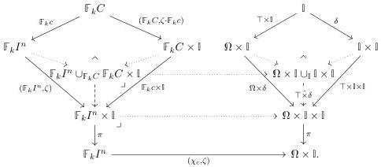

elements of \(\Omega \times \mathbb{I}\) and defined by pulling back the given internal family of maps to representables. The cartesian functor \(J\) lifts the Yoneda embedding \(\nmid\) from the discrete fibration associated to the category of elements of the functor \(\Omega \times \mathbb{I}\) to the codomain fibration:

\[
\begin{array}{c} \int \Omega \times \mathbb {I} \xrightarrow {J} (\mathrm{cSet} ^ {\Sigma}) ^ {2} \\ \pi \Big \downarrow \qquad \qquad \qquad \qquad \qquad \qquad \qquad \qquad \qquad \qquad \qquad \qquad \qquad \qquad \qquad \qquad \qquad \qquad \qquad \qquad \qquad \qquad \qquad \qquad \qquad \qquad \qquad \qquad \qquad \qquad \qquad \qquad \qquad \qquad \\ \square \times \Sigma^ {\mathrm{op}} \xrightarrow {\perp} \mathrm{cSet} ^ {\Sigma}. \end{array}
\]

Explicitly, the functor \( J \) sends an element \( (c, \zeta) \) to the pullback along it of the universal element \( \top \hat{\times} \delta \), as indicated below:

The resulting map \( J(c, \zeta) = (\chi_c, \zeta)^*(\top \hat{\times} \delta) \) can also be computed as the pushout product of the subobject \( \mathbb{F}_k c \colon \mathbb{F}_k C \mapsto \mathbb{F}_k I^n \) and the generic point \( \delta \colon \mathbb{I} \to \mathbb{I} \times \mathbb{I} \) regarded as maps in the slice over \( \mathbb{I} \) via \( \zeta \colon \mathbb{F}_k I^n \to \mathbb{I} \) and \( \pi \colon \mathbb{I} \times \mathbb{I} \to \mathbb{I} \).

Note the map \(\delta\) pulls back along \((\chi_c, \zeta)\) to define the graph \((\mathbb{F}_k C, \zeta \cdot \mathbb{F}_k c) \colon \mathbb{F}_k C \to \mathbb{F}_k C \times \mathbb{I}\) of \(\zeta \cdot \mathbb{F}_k c \colon \mathbb{F}_k C \to \mathbb{I}\) and similarly \(\Omega \times \delta\) pulls back to define the graph of \(\zeta \colon \mathbb{F}_k I^n \to \mathbb{I}\). Henceforth, for any map \(\gamma \colon \mathbb{A} \to \mathbb{B}\), we shall write \([\gamma] \colon \mathbb{A} \to \mathbb{A} \times \mathbb{B}\) for its graph \((\mathbb{A}, \gamma)\).

Morphisms in \(\int \Omega \times \mathbb{I}\)

\[
\begin{array}{c} \mathbb {F} _ {k} I ^ {m} \xrightarrow [ (\chi_ {d} , \xi) ]{\alpha \times \sigma} \mathbb {F} _ {k} I ^ {n} \\ \Omega \times \mathbb {I} \end{array}
\]

correspond to pairs \(\alpha\colon I^{m}\to I^{n}\) and \(\sigma\in\Sigma_{k}\) as in (4.3.5). The functor \(J\) carries such a morphism to the following pullback square of cubical species:

\[
\begin{array}{c} \mathbb {F} _ {k} I ^ {m} \cup_ {\mathbb {F} _ {k} D} \mathbb {F} _ {k} D \times \mathbb {I} \xrightarrow {\alpha \times \sigma \times 1} \mathbb {F} _ {k} I ^ {n} \cup_ {\mathbb {F} _ {k} C} \mathbb {F} _ {k} C \times \mathbb {I} \\ \langle [ \xi ], \mathbb {F} _ {k} d \times 1 \rangle \Biggl \downarrow \quad \text {   } \quad \text {   } \quad \text {   } \quad \text {   } \quad \text {   } \quad \text {   } \quad \text {   } \quad \text {   } \quad \text {   } \quad \text {   } \quad \text {   } \quad \text {   } \quad \text {   } \quad \text {   } \quad \text {   } \quad \text {   } \end{array} \tag {4.3.7}
\]

We refer to the subobjects in the image of the functor J as open boxes, though the nature of the gluing of the “lid”  \( F_{k}I^{n} \)  onto the “box”  \( F_{k}C \times I \)  is somewhat subtle because it involves the map  \( \zeta: F_{k}I^{n} \to I \) . The open boxes are themselves pushout products on account of the following general lemma.

46