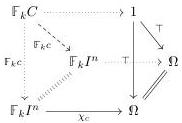
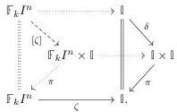
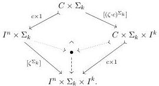

**Lemma 4.3.8.** If $i$ is a morphism in the slice over $\mathbb{X}$ and $j$ is a morphism in the slice over $\mathbb{Y}$ and $(x, y): \mathbb{Z} \to \mathbb{X} \times \mathbb{Y}$, then the pushout product of $i$ and $j$ in the slice over $\mathbb{X} \times \mathbb{Y}$ pulls back along $(x, y)$ to the map over $\mathbb{Z}$ obtained as the pushout product over $\mathbb{Z}$ of the evident pullbacks of $i$ and $j$.

*Proof.* Pushout products in slices are stable under pullback.

**Corollary 4.3.9.** *The open box*

$$\mathbb{F}_k I^n \cup_{\mathbb{F}_k C} \mathbb{F}_k C \times \mathbb{I} \xrightarrow{\langle [\zeta], \mathbb{F}_k c \times 1 \rangle} \mathbb{F}_k I^n \times \mathbb{I}$$

is the pushout product over $\mathbb{F}_k I^n$ of the maps obtained by pullback

*Remark 4.3.10.* Since the representables are concentrated in a single degree, each open box is as well. The “triangle” of cubical sets as below-left—where the first map is a morphism and the second map is between representables—gives rise to the “open-box” of cubical species as below-center, concentrated in degree $k$:

$$\begin{array}{ccc} C \xrightarrow{c} I^n & \mathbb{F}_k I^n \cup_{\mathbb{F}_k C} \mathbb{F}_k C \times \mathbb{I} & \Sigma_k \times I^n \cup_{\Sigma_k \times C} \Sigma_k \times C \times I^k \\ I^k & \downarrow \langle [\zeta], \mathbb{F}_k c \times 1 \rangle & \downarrow \langle [\zeta^{\Sigma_k}], 1 \times c \times 1 \rangle \\ & \mathbb{F}_k I^n \times \mathbb{I} & \Sigma_k \times I^n \times I^k. \end{array}$$

The non-empty component of this map is the map of $\Sigma_k$-cubical sets above-right, defined by the pushout below:

Here the action of $\Sigma_k$ is trivial on $C$ and $I^n$; by left multiplication on $\Sigma_k$; and by permuting the dimensions on $I^k$—the “regular” action. The map $[\zeta^{\Sigma_k}]: I^n \times \Sigma_k \to I^n \times \Sigma_k \times I^k$ is the graph of a twisted version of $\zeta$: the map $\zeta^{\Sigma_k}: I^n \times \Sigma_k \to I^k$ acts on the component of the domain coproduct indexed by $\sigma \in \Sigma_k$ by $\sigma \cdot \zeta: I^n \to I^k$. The top-right map is defined similarly. Note the maps in the pushout diagram are all $\Sigma_k$-equivariant, as required.

Similarly, the pullback square (4.3.7) is concentrated in degree $k$ and has the form

$$\begin{array}{ccc} I^m \times \Sigma_k \cup_{D \times \Sigma_k} D \times \Sigma_k \times I^k & \xrightarrow{\alpha \times \sigma \times 1} & I^n \times \Sigma_k \cup_{C \times \Sigma_k} C \times \Sigma_k \times I^k \\ \langle [\xi^{\Sigma_k}], d \times 1 \rangle & \downarrow & \downarrow \\ I^m \times \Sigma_k \times I^k & \xrightarrow{\alpha \times \sigma \times 1} & I^n \times \Sigma_k \times I^k \end{array}$$

47