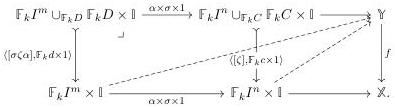
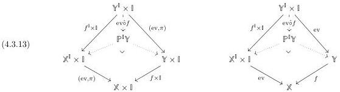
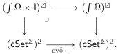

where \(\sigma \colon \Sigma_k \to \Sigma_k\) is defined by right multiplication. Note these definitions make the map \(\alpha \times \sigma \times 1: I^m \times \Sigma_k \times I^k \to I^n \times \Sigma_k \times I^k\) into a \(\Sigma_k\)-equivariant map.

Definition 4.3.11. Garner's algebraic small object argument [Gar09] yields an algebraic weak factorization system on \(\mathsf{cSet}^{\mathbb{X}}\) which is algebraically free on \(J\colon \int \Omega \times \mathbb{I}\to (\mathsf{cSet}^{\mathbb{X}})^2\), i.e., whose category of monad algebras is given by \((\int \Omega \times \mathbb{I})^{\square}\). In particular, a right map is a morphism \(f\colon \mathbb{Y}\to \mathbb{X}\) of cubical species equipped with chosen lifts against open boxes that are uniform in pullback squares:

We call the left and right classes of the underlying weak factorization system the trivial cofibrations and fibrations respectively.

We now show that these fibrations are the unbiased fibrations.

Definition 4.3.12. Given a map \( f \colon \mathbb{Y} \to \mathbb{X} \) define the parametrized path space by forming the Leibniz exponential of \( f \) with \( \delta \) in the slice over \( \mathbb{I} \), as displayed below-left:

where \(\mathrm{ev}\colon \mathbb{Y}^{\mathbb{I}}\times \mathbb{I}\to \mathbb{Y}\) is evaluation. Equivalently, the map \(\mathrm{ev}\hat{\circ} f\) may be defined by the pullback above-right, which is not formed in the slice over \(\mathbb{I}\).

From the second of these characterizations, ev  \( \hat{o} f \)  is the Leibniz pullback application of the evaluation natural transformation to the map f, explaining our notation. This functor is not right adjoint, failing to preserve the terminal object. However, from the decomposition

\[
(\mathsf {c S e t} ^ {\mathbb {X}}) ^ {2} \xrightarrow [ f \mapsto \mathrm{ev} \hat {\circ} f ]{- \times \mathbb {I}} (\mathsf {c S e t} _ {/ \mathbb {I}} ^ {\mathbb {X}}) ^ {2} \xrightarrow [ f \mapsto \mathrm{ev} \hat {\circ} f ]{\widehat {\{\delta , - \}}} (\mathsf {c S e t} _ {/ \mathbb {I}} ^ {\mathbb {X}}) ^ {2} \xrightarrow [ f \mapsto \mathrm{ev} \hat {\circ} f ]{\Sigma} (\mathsf {c S e t} ^ {\mathbb {X}}) ^ {2},
\]

it is the composition of a right adjoint with the forgetful functor \(\Sigma\). In particular, it preserves pullbacks.

Theorem 4.3.14. The category of uniform fibrations \((\int \Omega \times \mathbb{I})^{\square}\) is the pullback of the category of uniform trivial fibrations \((\int \Omega)^{\square}\) along the parametrized path space functor:

48