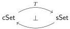
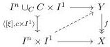
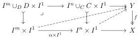

[CMS20; Awo26], namely the non-contractibility of automorphism quotients of cubes. In cartesian cubical sets, the group of automorphisms of the representable n-cube  \( I^{n} \)  is the symmetric group  \( \Sigma_{n} \) : the only automorphisms are the permutations of the axes of the cube. For any subgroup  \( H \subset \Sigma_{n} \) , we then have a quotient  \( I_{/H}^{n} \in cSet \) , the colimit of the H-indexed diagram sending a permutation to the corresponding automorphism of  \( I^{n} \) . When H is non-trivial,  \( I_{/H}^{n} \)  is not contractible in this model structure.

First, to see why this is problematic, let us consider a natural comparison to a model category presenting the homotopy theory of spaces: the adjunction

between cartesian cubical and simplicial sets whose left adjoint, triangulation, sends the \(n\)-cube to the \(n\)-ary cartesian product of the 1-simplex. This adjunction is in fact a Quillen adjunction, but the triangulations \(TI_{/H}^{n} \in \mathsf{sSet}\) are all contractible; for example, the quotient \(I_{/\Sigma_2}^2\) is isomorphic to \(\Delta^2\). As the left adjoint of a Quillen equivalence reflects contractibility of cofibrant objects [Hov99, 1.3.16], this adjunction cannot be a Quillen equivalence if \(I_{/H}^{n}\) is not contractible. Of course, the model structure on cSet could present spaces without this particular adjunction being a Quillen equivalence. However, it is worth noting that triangulation does define a Quillen equivalence from the test model structure on cSet to the Kan-Quillen model structure on sSet (see §6.3).

Second, let us give some intuition as to why  \( I_{/H}^{n} \)  is not contractible in the model structure of [CMS20; Awo26]. We recall the “uniform unbiased box-filling” characterization of its fibrations alluded to above. Briefly, a map  \( f: Y \to X \)  is a fibration when it admits a choice of lifts

for each lifting problem against an open box inclusion (determined by a subobject \( c \colon C \hookrightarrow I^n \) and generalized point \( \xi \colon I^n \to I^1 \)) in such a way that for every morphism of cubes \( \alpha \colon I^m \to I^n \), the resulting triangle

formed by the two chosen lifts commutes.

In the language of algebraic weak factorization systems (awfs), the class of fibrations is generated by the category of open box inclusions and pullback squares between them. In fact, this open box category generates categories of trivial cofibration coalgebras and fibration algebras, which by Garner's algebraic small object argument [Gar09] constitute an awfs. There is then an underlying weak factorization system whose left and right maps are the retracts of maps admitting trivial cofibration coalgebra and fibration algebra structures respectively. \( ^{4} \)  The forgetful functor sending a trivial cofibration coalgebra to its underlying map creates colimits, and the open box category

\( ^{4} \) Since the awfs under consideration is cofibrantly generated by a category, the monad algebras are already retract closed. Equivalently, the left and right maps are those admitting coalgebra structures for the copointed endofunctor underlying the comonad and algebra structures for the pointed endofunctor underlying the monad, respectively.

5