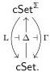

5.1. From cubical species to equivariant cubical sets. The category of cubical sets embeds faithfully into the category of cubical species via the constant diagram functor

$$\Delta \colon \mathsf{cSet} \to \mathsf{cSet}^{\Sigma} \cong \prod_{k \geq 1} \mathsf{cSet}^{\Sigma_k},$$

which is fully faithful on each factor $\mathsf{cSet}^{\Sigma_k}$ though only faithful on the whole. Since the groupoid $\Sigma$ is small and $\mathsf{cSet}$ is bicomplete, this functor admits left and right adjoints:

The left adjoint L takes the colimit over the groupoid $\Sigma$, and the right adjoint $\Gamma$ takes the limit. Explicitly, for a cubical species $\mathbb{X} = (X^k)_{k \geq 1}$, we have

$$\mathrm{L}(\mathbb{X}) := \prod_{k \geq 1} X^k_{/\Sigma_k}$$

$$\Gamma(\mathbb{X}) := \prod_{k \geq 1} (X^k)^{\Sigma_k}$$

where $X^k_{/\Sigma_k}$ is the cubical set of **orbits**, the quotient of the $\Sigma_k$-cubical set $X^k$ by its action, and $(X^k)^{\Sigma_k}$ is the cubical set of $\Sigma_k$-**fixed points**.

As a category of actions by a groupoid, the topos $\mathsf{cSet}^{\Sigma}$ is well-known to be atomic over $\mathsf{cSet}$, and $\Delta \colon \mathsf{cSet} \to \mathsf{cSet}^{\Sigma}$ to be a logical functor, preserving (co)limits, the subobject classifier and the locally cartesian closed structure. We provide some explicit calculations of these.

**Example 5.1.1.** For $n, k \in \mathbb{N}$ and $k \geq 1$, we have $\mathrm{L}(\mathbb{F}_k I^n) \cong I^n$, reflecting the fact that left Kan extensions preserve representables. More generally, for any cubical set $X$, we have $\mathrm{L}(\mathbb{F}_k X) \cong X$, as $\mathrm{L} \cdot \mathbb{F}_k$ is left adjoint to the identity functor.

**Example 5.1.2.** We calculate

$$\mathrm{L}(\mathbb{I}) \cong \prod_{k \geq 1} I^k_{/\Sigma_k} \quad \text{and} \quad \Gamma(\mathbb{I}) \cong \prod_{k \geq 1} I \cong I^\omega$$

using the fact that $(I^k)^{\Sigma_k} \cong I$ for all $k > 0$.

The left adjoint L is far from being left exact, failing to preserve pullbacks (since 1-categorical quotients by a group action do not commute with pullbacks) and even finite products (since coproducts do not commute with finite products); in particular, $\mathrm{L}(\mathbb{1}) \cong \mathbb{N}$. It does, however, interact well with certain finite limits involving constant cubical species.

**Corollary 5.1.3.** *The constant diagram functor $\Delta \colon \mathsf{cSet} \to \mathsf{cSet}^{\Sigma}$ preserves pushforwards and exponentials.*

*Proof.* This is an instance of Corollary 4.1.4.

**Lemma 5.1.4.** *The constant diagram functor $\Delta \colon \mathsf{cSet} \to \mathsf{cSet}^{\Sigma}$ preserves the subobject classifier and creates monomorphisms.*

*Proof.* Preservation of the subobject classifier is an instance of Corollary 4.1.6. For creation of monomorphisms, recall that monomorphisms in $\mathsf{cSet}^{\Sigma}$ are defined pointwise and that $\Sigma$ is inhabited.

53