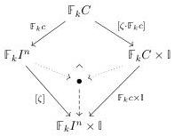
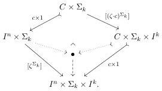
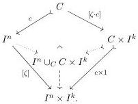

The functor $J$ sends an element $(c, \zeta)$ to the morphism of cubical species defined by pushout of cubical species below-left, which corresponds to the pushout of $\Sigma_k$-cubical sets below-right:

The image of the left-hand diagram under L is given by passing to orbits in the diagram of $\Sigma_k$-cubical sets above-right, and this can be calculated using Lemma 5.2.3. This results in the pushout diagram of cubical sets

We again refer to the subobjects in the image of the functor $J$ as **open boxes** though the nature of the gluing of the “lid” $I^n$ onto the “box” $C \times I^k$ is somewhat subtle because it involves the map $\zeta: I^n \to I^k$.

The functor $J$ sends morphisms (4.3.5) to the pullback square of cubical species below-left, which corresponds to the pullback square of $\Sigma_k$-cubical sets below-right:

$$\begin{array}{c c c} \mathbb{F}_k I^m \underset{\mathbb{F}_k D}{\cup} \mathbb{F}_k D \times \mathbb{I} \xrightarrow{\alpha \times \sigma \times 1} \mathbb{F}_k I^n \underset{\mathbb{F}_k C}{\cup} \mathbb{F}_k C \times \mathbb{I} & I^m \times \Sigma_k \underset{D \times \Sigma_k}{\cup} D \times \Sigma_k \times I^k \xrightarrow{\alpha \times \sigma \times 1} I^n \times \Sigma_k \underset{C \times \Sigma_k}{\cup} C \times \Sigma_k \times I^k \\ \langle [\xi], \mathbb{F}_k d \times 1 \rangle \Bigg\downarrow & \Bigg\downarrow \quad \Bigg\downarrow \langle [\zeta], \mathbb{F}_k c \times 1 \rangle & \langle [\xi^{\Sigma_k}], d \times 1 \rangle \Bigg\downarrow \\ \mathbb{F}_k I^m \times \mathbb{I} \xrightarrow{\alpha \times \sigma \times 1} \mathbb{F}_k I^n \times \mathbb{I} & I^m \times \Sigma_k \times I^k \xrightarrow{\alpha \times \sigma \times 1} I^n \times \Sigma_k \times I^k. \end{array}$$

Passing to orbits using Lemma 5.2.3 this becomes

$$\begin{array}{c c c} I^m \cup_D D \times I^k & \xrightarrow{\alpha \times \sigma^{-1}} & I^n \cup_C C \times I^k \\ \langle [\xi], d \times 1 \rangle \Bigg\downarrow & \Bigg\downarrow & \Bigg\downarrow \langle [\zeta], c \times 1 \rangle \\ I^m \times I^k & \xrightarrow{\alpha \times \sigma^{-1}} & I^n \times I^k. \end{array}$$

56