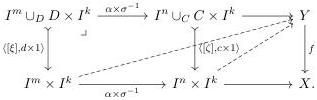
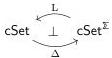
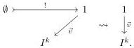
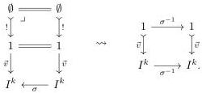

Thus, an equivariant fibration is a morphism \( f \colon Y \to X \) of cubical sets equipped with chosen lifts against open boxes that are uniform in pullback squares:

By Garner's algebraic small object argument, the functor  \( LJ: \int \Omega \times \mathbb{I} \to cSet^{2} \)  generates a (trivial cofibration, equivariant fibration) algebraic weak factorization system. Thus we have a functorial factorization for both weakly orthogonal classes, completing the definition of a premodel structure which we call the equivariant premodel structure. By construction:

Lemma 5.2.5. The adjunction

defines a Quillen adjunction of premodel structures between the equivariant premodel structure on cSet and the interval model structure on cSet \( ^{\Sigma} \) .

An argument similar to the proof of Lemma 4.3.15 can be used to identify explicit trivial cofibrations.

Lemma 5.2.6. For any \( k \geq 1 \) and subgroup \( G \subset \Sigma_k \) the inclusions \( \vec{0}, \vec{1} \colon 1 \to I_{/G}^k \) of the initial or final vertices into the quotient cubical set define trivial cofibrations.

Proof. By Construction 5.2.4, the triangle below-left gives rise to the generating trivial cofibration below-right:

When \(\vec{v}\) is the point \(\vec{0}\) or \(\vec{1}\), then any \(\sigma \in \Sigma_k\) defines a morphism of triangles, as below-left, giving rise to the morphism in the generating category of trivial cofibrations displayed below-right:

Thus, the maps \(\vec{0},\vec{1}\colon 1\to I_{/G}^{k}\) arise as colimits of diagrams valued in the subcategory of generating trivial cofibrations. Since the equivariant fibrations lift uniformly against the generating category, they lift against colimits of diagrams valued in there, proving that the inclusions \(\vec{0},\vec{1}\colon 1\to I_{/G}^{k}\) are trivial cofibrations.

In particular:

57