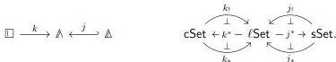

*Proof.* Once more, the only result of the statement that we have not yet proven is the fact that the interval premodel structure is in fact a model structure, but this follows formally from Proposition 3.7.3, by Proposition 5.3.10 and the fact that all objects are cofibrant. □

Thus, the equivariant model structure on the topos of cubical sets is a model of homotopy type theory. In contrast to the model of Theorem 4.4.9, the equivariant model structure presents classical homotopy theory, as we demonstrate in the next section.

## 6. THE EQUIVALENCE WITH CLASSICAL HOMOTOPY THEORY

In this section we prove our final main result, that the equivariant cubical model category of Theorem 5.3.11 is equivalent to classical homotopy theory. More specifically, we demonstrate that the triangulation functor $T: \mathbb{C} \to \mathbb{S}$ defines a left Quillen equivalence from the equivariant model structure, whose fibrations are the equivariant fibrations, to Quillen's model structure on simplicial sets [Qui67], whose fibrations are the Kan fibrations. This argument makes use of classical reasoning; see §1.6.2 above.

Our proof makes central use of the fact that the indexing categories $\square$ and $\triangle$ are *Eilenberg–Zilber categories*, a special class of (generalized) Reedy categories introduced by Berger and Moerdijk [BM11]. We develop some general theory of Eilenberg–Zilber categories in §6.2 for that purpose. In particular, we prove in Corollary 6.2.16 that to check that a natural transformation between left Quillen functors with either $\mathbb{C}$ or $\mathbb{S}$ as domain is a natural weak equivalence, it will suffice to check this on those components indexed by quotients of representables by subgroups of their automorphism groups. And in fact, by the two-of-three property, this will follow automatically for terminal object preserving functors, provided these objects are weakly contractible—as is the case in both the equivariant model structure on $\mathbb{C}$ and the classical model structure on $\mathbb{S}$.

These results make it easy to prove that an opposing pair of left Quillen functors between $\mathbb{S}$ and $\mathbb{C}$ define a derived equivalence, and thus we seek a left Quillen functor from $\mathbb{S}$ to $\mathbb{C}$ to define a candidate inverse to triangulation. Our original proof proceeded along the following lines. In [Sat19], Sattler observes that the idempotent completion of the category of *Dedekind* cubes—the full subcategory of $\mathbb{C}$ on the posets $\{0 < 1\}^n$ for $n \geq 0$, which adds connections to the cartesian cubes $\square$—is the category $\triangle$ whose objects are the finite bounded lattices and whose morphisms are the monotone maps between them. Thus the category $\ell$ of presheaves on $\triangle$ is equivalent to the category of presheaves on the Dedekind cubes, which we can equip with the model structure defined in [Sat17], following [CCHM15]. The utility of this result is that the finite ordinals $[n] = \{0 < 1 < \dots < n\}$ are finite complete lattices; indeed, we have a fully faithful embedding $j: \triangle \hookrightarrow \triangle$, in addition to the evident (non-full) inclusion $k: \square \to \triangle$ of the cartesian cube category. These functors induce adjoint triples of functors

with the left and right adjoints defined by left and right Kan extension. The composite $j^*k_t: \mathbb{C}$ to $\mathbb{S}$ is the triangulation functor and one can verify that $k^*j_t: \mathbb{S}$ to $\mathbb{C}$ is a left Quillen homotopy inverse.

While this article was in preparation, Reid Barton observed that the triangulation functor in fact arises by restriction along a single functor $i: \triangle \to \square$, and in particular has a left adjoint, which is also left Quillen [Bar24b]. These results are verified in §6.1. In §6.2, we then apply the theory of

61