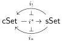

Eilenberg–Zilber categories sketched above to conclude that all three functors in the adjoint triple

are Quillen equivalences. Finally, in §6.3, we compare the equivariant model structure on cubical sets to the test model structure of Cisinski after Grothendieck and prove that they coincide.

6.1. Triangulation. As Barton observed, implicit in Joyal's proof that sSet is the classifying topos for a strict interval is the definition of a faithful dimension-preserving functor

\[
\begin{array}{c} \mathbb {A} \xrightarrow {i} \mathbb {D} \\ \{0 <   \dots <   n \} \longmapsto \{\bot , 1, \ldots , n, \top \} \end{array}
\]

from the simplex category to the cartesian cube category. This functor may be defined using Joyal's "interval representation" [Joy97], a contravariant isomorphism between \(\Delta\) and the opposite of the category of strict intervals, linearly ordered sets \(\{\top > 1 > \cdots > n > \top\}\) for \(n \geq 0\) with \(\bot \neq \top\), and endpoint-preserving ordered maps.\(^{10}\) The category of strict intervals is evidently a subcategory of finite bipointed sets \(\mathsf{Fin}_{\bot \neq \top} \cong \mathbb{D}^{\mathrm{op}}\), thus defining \(i: \Delta \to \mathbb{D}\).

The functor \(i\) sends sends outer face maps \(\delta^0, \delta^n: [n-1] \to [n]\) to the face maps \(I^{n-1} \to I^n\) that respectively fix the first cube coordinate to be \(\top\) and the last cube coordinate to be \(\bot\). The inner face maps \(\delta^i: [n-1] \to [n]\) are sent to the diagonal maps \(I^{n-1} \to I^n\) that identify the \(i\)th and \((i+1)\)th coordinates. The degeneracy maps \(\sigma^i: [n+1] \to [n]\) are sent to the projections \(I^{n+1} \to I^n\) away from the \((i+1)\)th coordinate.

Barton then observed:

Lemma 6.1.1 (Barton). Restriction along i defines the triangulation functor  \( i^{*}: cSet \to sSet \) .

Proof. The triangulation functor is the unique cocontinuous functor extending the product-preserving functor \(\square \to \mathsf{sSet}\) that carries the interval in \(\square\) to the interval in \(\mathsf{sSet}\):

\[
\begin{array}{c} \square \xrightarrow {\text {上}} \mathsf {c S e t} \xrightarrow {T} \mathsf {s S e t} \\ \{\bot , \top \} \longmapsto I ^ {0} \longmapsto \Delta^ {0} \\ \biguplus \mapsto \biguplus \mapsto \biguplus \\ \{\bot , 1, \top \} \longmapsto I ^ {1} \longmapsto \Delta^ {1}. \end{array}
\]

The restriction functor \( i^* \colon \mathsf{cSet} \to \mathsf{sSet} \) is cocontinuous and product-preserving, as is the Yoneda embedding \( \mathbb{1} \colon \square \hookrightarrow \mathsf{cSet} \), so it suffices to show that \( i^*(I^1) = \Delta^1 \) and similarly for the interval maps. Since \( i[1] := \{\bot, 1, \top\} \), \( i^*(I^1) \) is the functor \( \square(i[-], i[1]) \colon \Delta^{\mathrm{op}} \to \mathsf{Set} \). Now the claim follows because the inclusion \( i \) is fully faithful on maps with codomain [1], as in \( \mathsf{Fin}_{\bot \neq \top} \cong \square^{\mathrm{op}} \) any map of bipointed sets with domain \( \{\bot, 1, \top\} \) is order-preserving.

As a right adjoint, \( i^{*}(I^{0}) = \Delta^{0} \) and by inspection, \( i^{*} \) carries the maps \( 0,1\colon I^0\to I^1 \) and \( !\colon I^1\to I^0 \) in \( \square \) to the corresponding maps involving \( \Delta^1 \). Thus \( i^{*} \) coincides with the triangulation functor, as claimed.

\( ^{10} \) Our atypical choice of ordering on the interval coordinates is chosen to match the conventions used in [RS17], which uses the functor  \( i: \Delta \to \square \)  to give a syntactic encoding of the simplices as “shapes” embedded in cubes.

62