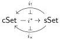
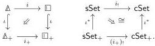

We now verify that both left adjoints in the adjoint triple

are left Quillen. To analyze the left Kan extension \(i_{!}\), it will be useful to establish the relationship between \(i\) and its augmented analogue. Let \(\Delta_{+}\) and \(\square_{+}\) denote the augmented simplex and augmented cube categories, obtained by freely adjoining initial objects, and write \(i_{+}:\Delta_{+}\to\square_{+}\) for the functor induced by \(i\) that preserves them. Write \(\mathsf{sSet}_{+}:=\mathsf{Set}^{\Delta_{+}^{\mathrm{op}}}\) and \(\mathsf{cSet}:=\mathsf{Set}^{\square_{+}^{\mathrm{op}}}\).

Lemma 6.1.2. The commutative square below-left is exact, defining a canonical natural isomorphism in the square of functors below-right:

Proof. Here the isomorphism in the square above-right is the Beck–Chevalley transformation associated to the identity natural transformation in the square above-left, and thus is invertible when the square is exact [Gui80]. Exactness of this square follows from the general observation that for any functor  \( k: C \to D \) , any commutative square of the form below is exact:

\[
\begin{array}{c} \text {C} \xrightarrow {k} \text {D} \\ \iota \Big \downarrow \quad \not \llcorner \quad \Big \downarrow \iota \\ \mathbb {1} * \text {C} \xrightarrow [ \mathbb {1} * k ]{} \mathbb {1} * \text {D}. \end{array}
\]

This in turn can be detected by pasting with exact squares into \(\iota\colon\mathsf{C}\hookrightarrow\mathbb{1}*\mathsf{C}\) over any family of jointly surjective functors into \(\mathbb{1}*\mathsf{C}\) [Mal12, 2.8 with \(\mathcal{W}=\mathcal{W}_{0}\)], such as the pair formed by the left and right inclusions \(\iota\colon\mathbb{1}\hookrightarrow\mathbb{1}*\mathsf{C}\) and \(\iota\colon\mathsf{C}\hookrightarrow\mathbb{1}*\mathsf{C}\). To that end we observe that

\[
\begin{array}{c c} \emptyset \xrightarrow {} \mathsf {C} \xrightarrow {k} \mathsf {D} & \emptyset \xrightarrow {} \mathsf {D} \\ \Big \downarrow \quad \not \llcorner \quad \iota \Big \downarrow \quad \not \llcorner \quad \Big \downarrow \iota \\ \mathbb {1} \xrightarrow [ \iota ]{} \mathbb {1} * \mathsf {C} \xrightarrow [ \mathbb {1} * k ]{} \mathbb {1} * \mathsf {D} & \mathbb {1} \xrightarrow [ \iota ]{} \mathbb {1} * \mathsf {D} \end{array}
\]

where both the left-hand square and the composite rectangle are comma squares, and thus exact. Similarly, the left-hand and right-hand squares in the pasting equation below are exact since the functors  \( \iota \)  are fully-faithful,

\[
\begin{array}{c c} \text {C} \xlongequal {} \text {C} \xrightarrow {k} \text {D} & \text {C} \xrightarrow {k} \text {D} \xlongequal {} \text {D} \\ \left\| \quad \not \llcorner \quad \iota \Big \downarrow \quad \not \llcorner \quad \Big \downarrow \iota \right. & = \\ \text {C} \xleftarrow [ \iota ]{} \mathbb {1} * \text {C} \xrightarrow [ \mathbb {1} * k ]{} \mathbb {1} * \text {D} & \text {C} \xrightarrow [ k ]{} \text {D} \xleftarrow [ \iota ]{} \mathbb {1} * \text {D}, \end{array}
\]

while the trivial square is trivially exact.

Using this, we now demonstrate:

63