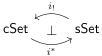

# Lemma 6.1.3. The functors

preserve monomorphisms.

Proof. This is immediate for the right adjoint $i^*$. For the left adjoint $i_!$, we observe

$$i_! \cong i_! \iota^* \iota_* \cong \iota^* (i_+)_! \iota_*,$$

by Lemma 6.1.2 and fully faithfulness of $\iota: \Delta \hookrightarrow \Delta_+$. Thus, to prove that $i_!$ preserves monomorphisms it suffices to prove that $(i_+)_!$ does.

Monomorphisms in $\mathsf{sSet}_+$ decompose canonically as sequential colimits of pushouts of coproducts of maps of the form $\partial \Delta^n \hookrightarrow \Delta^n$. As a left adjoint, $(i_+)_!$ preserves cell complexes, so it suffices to show that this functor carries these generating maps to monomorphisms. Each boundary inclusion is the joint image of the family of monomorphisms $\delta: \Delta^m \hookrightarrow \Delta^n$ indexed by monomorphisms $\delta: [m] \hookrightarrow [n]$ in $\Delta_+$ with codomain $[n]$. Thus, it suffices to prove that $(i_+)_!$ preserves joint images of monomorphisms between representables. In a Grothendieck topos, the joint image of monomorphisms $(m_i: A_i \hookrightarrow B)_{i \in I}$ is given by the coequalizer of the following parallel pair of maps in the slice over $B$

$$\coprod_{i,j \in I} A_i \times_B A_j \longrightarrow \coprod_{k \in I} A_k$$

and thus a cocontinuous functor between Grothendieck toposes will preserve the joint image of a family of monomorphisms provided it preserves the pullbacks of cospans in the family. In the case of the functor $(i_+)_!$ and the family of monomorphisms $(\delta_i: \Delta^{m_i} \hookrightarrow \Delta^n)_i$, we'll demonstrate this by showing that $\Delta_+$ has pullbacks of face maps and $i_+: \Delta_+ \to \square_+$ preserves them.$^{11}$

The functor $i_+: \Delta_+ \to \square_+$ is the opposite of the functor $i_+: \mathsf{FinInt} \to \mathsf{Fin}_{\bot, \top}$ from the category of finite intervals $\{\bot > 1 > \cdots > n > \top\}$, now possibly with $\bot = \top$, to the category of finite bipointed sets, now dropping the requirement that the basepoints are distinct. We must show that $\mathsf{FinInt}$ has and $i_+: \mathsf{FinInt} \to \mathsf{Fin}_{\bot, \top}$ preserves pushouts of epimorphisms, or equivalently for any finite interval $A$ that the comma category $A \downarrow \mathsf{FinInt}$ has and the forgetful functor $i_+: A \downarrow \mathsf{FinInt} \to i_+ A \downarrow \mathsf{Fin}_{\bot, \top}$ preserves binary coproducts of epimorphisms. On account of the epimorphism–monomorphism orthogonal factorization systems, it suffices to restrict to the subcategories of epimorphisms $\mathsf{FinInt}^{\mathrm{epi}}$ and $\mathsf{Fin}_{\bot, \top}^{\mathrm{epi}}$ and show that binary coproducts exist in $A \downarrow \mathsf{FinInt}^{\mathrm{epi}}$ are preserved by the forgetful functor between comma categories $i_+: A \downarrow \mathsf{FinInt}^{\mathrm{epi}} \to i_+ A \downarrow \mathsf{Fin}_{\bot, \top}^{\mathrm{epi}}$.

For a finite interval $A$, the category $A \downarrow \mathsf{FinInt}^{\mathrm{epi}}$ is the poset whose objects are equivalence relations on the underlying set of $A$ whose equivalence classes are subintervals of $A$ (where the inclusion of a subinterval need not preserve endpoints). The category $i_+ A \downarrow \mathsf{Fin}_{\bot, \top}^{\mathrm{epi}}$ is the poset whose objects are equivalence relations on the underlying set of $A$. Using these descriptions, we see that the functor $i_+: A \downarrow \mathsf{FinInt}^{\mathrm{epi}} \to i_+ A \downarrow \mathsf{Fin}_{\bot, \top}^{\mathrm{epi}}$ is a coreflective embedding, whose right adjoint sends an equivalence relation on the underlying set of $A$ to the equivalence relation that relates elements $x$ and $y$ of $A$ if only if the closed subinterval spanned by these elements belongs to a single equivalence class. In particular, this forgetful functor creates the coproducts that exist in $i_+ A \downarrow \mathsf{Fin}_{\bot, \top}^{\mathrm{epi}}$, which demonstrates what we needed to show.

$^{11}$This is the advantage of working with $i_+$ rather than $i$; $\Delta$ does not have pullbacks of all face maps.

64