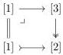
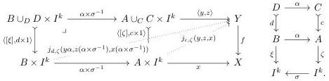

Remark 6.1.4. The closely-related criterion of [Sat19, 3.5] is not strong enough to demonstrate that $i_!$ or $(i_+)$! preserve monomorphisms since the pullback in $\Delta$

of the maps specified by preserving initial and terminal elements is not preserved by the inclusion into the cartesian cube category. Note however that only one of the maps in the original cospan is a monomorphism. The proof just given demonstrates that pullbacks of pairs of monomorphisms in $\Delta_+$ exist and are preserved by $i_+$.

Lemma 6.1.5. The functor $i_! \colon \mathsf{sSet} \to \mathsf{cSet}$ defines a left Quillen functor from the classical model structure to the equivariant model structure.

Proof. As in [Sat19, 3.6], it suffices to show that $i_!$ carries generalized horn inclusions—inclusions of the union of a proper subset of codimension-one faces into a simplex—to trivial cofibrations. Such generalized horn inclusions either have the form of a face map $\delta \colon \Delta^{n-1} \to \Delta^n$ or are pushouts of a generalized horn inclusion with one less face and in one smaller dimension. Thus, by the 2-of-3 property and induction over the dimension and the number of faces in the generalized horn inclusion, it suffices to show that $i_! \Delta^n \cong I^n$ is weakly contractible for each $n$, which holds because the cubes are weakly contractible in the equivariant model structure by Corollary 5.2.7.

We prove that the other left adjoint $i^* \colon \mathsf{sSet} \to \mathsf{cSet}$ is left Quillen by first demonstrating a result of independent interest: that Kan fibrations of simplicial sets are also equivariant fibrations, which we define as follows.

Definition 6.1.6. Let $\mathsf{E}$ be a locally cartesian closed category equipped with a product-preserving functor $\square \to \mathsf{E}$ from the cartesian cube category, which restricts along the inclusion $\Sigma \subset \square$ to define a symmetric sequence $\mathbb{I} \colon \Sigma \to \mathsf{E}$, specifying $k$-cubes $I^k$ in $\mathsf{E}$ for all $k \ge 1$ together with automorphisms for each $\sigma \in \Sigma_k$. Then an equivariant fibration is a map $f \colon Y \to X$ whose image under the constant diagram functor $\Delta \colon \mathsf{E} \to \mathsf{E}^{\Sigma}$ is an unbiased uniform fibration, i.e., a map which enjoys the uniform lifting property as below-left defined relative to the diagram in $\mathsf{E}$ below-right:

When $\mathsf{E}$ is a presheaf category, it suffices to consider uniform lifting against monomorphisms with representable codomain.

Proposition 6.1.7. Kan fibrations of simplicial sets are equivariant fibrations.

Proof. Since the classical model structure on simplicial sets is cartesian closed, any Kan fibration $f \colon Y \to X$ admits the structure of a biased uniform fibration, as in Definition 3.6.7i with respect to the interval $\Delta^1$; see [GS17, §9]. In fact, when $f \colon Y \to X$ is a Kan fibration, it also admits the structure of an unbiased uniform fibration by [CS25, 4.22–23].

65