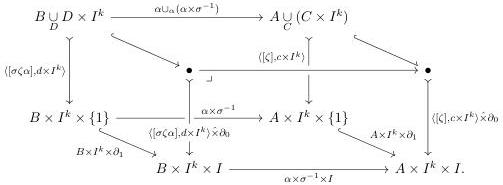

along $\alpha \times \sigma^{-1} \colon B \times I^k \to A \times I^k$. Observe that we can perform these two restrictions needed to compute $j_{c,\zeta}(y, z, x) \cdot (\alpha \times \sigma^{-1})$ in either order, on account of the commutative cube

Thus:

$$\begin{array}{l} j_{c,\zeta}(y, z, x) \cdot (\alpha \times \sigma^{-1}) \\ = i_{\langle c \times I^k, [\zeta] \rangle, 0} (i_{c,1}(y, z\vec{\gamma}_{\wedge}\zeta c, x\vec{\gamma}_{\wedge}\zeta)!, x\gamma_{\wedge}) \cdot (A \times I^k \times \partial_1) \cdot (\alpha \times \sigma^{-1}) \\ = i_{\langle c \times I^k, [\zeta] \rangle, 0} (i_{c,1}(y, z\vec{\gamma}_{\wedge}\zeta c, x\vec{\gamma}_{\wedge}\zeta)!, x\gamma_{\wedge}) \cdot (\alpha \times \sigma^{-1} \times I) \cdot (B \times I^k \times \partial_1) \end{array}$$

Note further that the front face of this cube is a pullback, since it arises as the pushout product of the pullback in the back face with $\partial_1 \colon \{1\} \mapsto I$. By uniformity of $(f, i)$ in this pullback square:

$$= i_{\langle d \times I^k, [\sigma\zeta\alpha] \rangle, 0} (i_{c,1}(y, z\vec{\gamma}_{\wedge}\zeta c, x\vec{\gamma}_{\wedge}\zeta)(\alpha \times I)!, x\gamma_{\wedge}(\alpha \times \sigma^{-1})) \cdot (B \times I^k \times \partial_1)$$

By the uniformity calculation above, the domains of these lifting problems coincide. Thus:

$$\begin{array}{l} = i_{\langle d \times I^k, [\sigma\zeta\alpha] \rangle, 0} (i_{d,1}(y\alpha, z(\alpha \times \sigma^{-1})\vec{\gamma}_{\wedge}\sigma\zeta\alpha d, x(\alpha \times \sigma^{-1})\vec{\gamma}_{\wedge}\sigma\zeta\alpha)!, x(\alpha \times \sigma^{-1})\gamma_{\wedge}) \cdot (B \times I^k \times \partial_1) \\ = j_{d,\sigma\zeta\alpha}(y\alpha, z(\alpha \times \sigma^{-1}), x(\alpha \times \sigma^{-1})), \end{array}$$

which is the required equivariant uniformity condition.

**Lemma 6.1.8.** *The functor $i^* \colon \mathsf{cSet} \to \mathsf{sSet}$ defines a left Quillen functor from the equivariant model structure to the classical model structure.*

*Proof.* To prove that triangulation is left Quillen, it suffices to show that the right adjoint $i_*$ carries Kan fibrations to equivariant fibrations of cubical sets, for which it suffices to show that Kan fibrations lift against the image of the generating category of Construction 5.2.4 under the functor $i^*$. After triangulation, the objects and morphisms in this generating category have the form

$$\begin{array}{c} (\Delta^1)^m \cup_D D \times (\Delta^1)^k \xrightarrow{\alpha \times \sigma^{-1}} (\Delta^1)^n \cup_C C \times (\Delta^1)^k \\ \langle [\xi], d \times 1 \rangle \Big\downarrow \quad \text{↵} \quad \Big\downarrow \langle [\zeta], c \times 1 \rangle \\ (\Delta^1)^m \times (\Delta^1)^k \xrightarrow[\alpha \times \sigma^{-1}]{} (\Delta^1)^n \times (\Delta^1)^k \end{array}$$

where $C$ and $D$ are triangulations of cubical subsets of the $n$-cube and $m$-cube respectively. Thus, the equivariance of Kan fibrations established in Proposition 6.1.7 defines uniform lifts against these squares.

To prove that the left Quillen functors of Lemmas 6.1.5 and 6.1.8 define Quillen equivalences, we appeal to the general theory of Eilenberg–Zilber categories, which we now review.

68