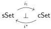
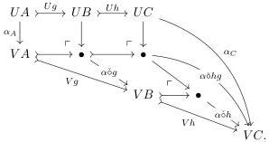

form $\emptyset \mapsto \mathsf{A}_{/H}^{b}$ with $\deg(b) \leq n$ under the inductive hypothesis that when $\deg(b) < n$, the maps $\emptyset \mapsto \overrightarrow{\partial}\mathsf{A}_{/H}^{b}$ are in this class. From right cancelation, this tells us that the maps $\overrightarrow{\partial}\mathsf{A}_{/H}^{b} \to \mathsf{A}_{/H}^{b}$ are in this class when $\deg(b) < n$. The presheaf $\overrightarrow{\partial}\mathsf{A}_{/H}^{a} \in \mathsf{Set}^{\mathsf{A}^{\mathrm{op}}}$ is $(n-1)$-skeletal, so from Proposition 6.2.11, we see that $j^{a} \colon \emptyset \mapsto \overrightarrow{\partial}\mathsf{A}_{/H}^{a}$ factors as a composite of pushouts of coproducts of the maps $\overrightarrow{\partial}\mathsf{A}_{/K}^{b} \hookrightarrow \mathsf{A}_{/K}^{b}$ for $K \subset \operatorname{Aut}(b)$, completing the induction.

We now return to the question of proving that the left Quillen functors $i_{!}$ and $i^{*}$ are Quillen equivalences. As the cofibrations are the monomorphisms, all objects in each of the categories sSet and cSet are cofibrant. By Ken Brown's lemma, left Quillen functors preserve weak equivalences between cofibrant objects. Consequently:

**Corollary 6.2.14.** *Each of the functors*

*preserves weak equivalences.*

To demonstrate that these functors are inverse left Quillen equivalences, it suffices to show that the total left derived functors define equivalences, for which it suffices to demonstrate that the unit $\eta \colon \mathrm{id} \Rightarrow i^{*}i_{!}$ and counit $\epsilon \colon i_{!}i^{*} \Rightarrow \mathrm{id}$ are natural weak equivalences. The advantage of working with an inverse pair of left adjoints is that we can use cocontinuity and the fact that both $\Delta$ and $\square$ are Eilenberg–Zilber to reduce to checking that certain components are weak equivalences. In fact, we can treat both cases at once, by an argument we now develop.

**Lemma 6.2.15.** *Let $U, V \colon \mathsf{K} \to \mathsf{M}$ be a cocontinuous pair of functors valued in a model category and $\alpha \colon U \Rightarrow V$ a natural transformation between them. Define the cofibrations in $\mathsf{K}$ to be the maps that are sent to cofibrations under both $U$ and $V$. Define $\mathcal{N}$ to be the class of cofibrations between cofibrant objects that are sent by Leibniz pushout application with $\alpha$ to weak equivalences in $\mathsf{M}$. Then $\mathcal{N}$ is closed under coproducts, pushouts, (transfinite) composition, and right cancelation among cofibrations.*

*Proof.* The claims all follow from the proofs of [RV14, §5], except for right cancelation, which is not mentioned there. We demonstrate this together with the closure under composition, as these are the most subtle closure properties. Consider a composable pair of monomorphisms and their Leibniz applications:

The diagram reveals that $\alpha \circ hg$ factors as a pushout of $\alpha \circ g$ followed by $\alpha \circ h$. When $g \in \mathcal{N}$ and $h$ is a cofibration, our hypotheses imply that the pushout of $\alpha \circ g$ is a pushout of a weak equivalence between cofibrant objects along a cofibration, hence again a weak equivalence. Thus, by the 2-of-3 properties for weak equivalences, $h \in \mathcal{N}$ if and only if $hg \in \mathcal{N}$.

73