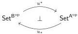

are the monomorphisms and the weak equivalences are those maps of presheaves $f: X \to Y$ such that the map of simplicial sets defined by applying the functor $N\mathsf{e}\mathsf{l}$, which takes the nerve of the category of elements, is a weak homotopy equivalence.

**Definition 6.3.1.** A category is **aspherical** if its nerve is weakly contractible in Quillen's model structure. A functor $u: \mathsf{A} \to \mathsf{B}$ between small categories is **aspherical** if the comma category $u \downarrow b$ is aspherical for every $b \in \mathsf{B}$. A presheaf over a small category is **aspherical** if its category of elements is aspherical.

Note that, by definition, a presheaf over a test category is aspherical if and only if it is weakly contractible in the test model structure.

*Remark 6.3.2* ([CS25, 7.14]). The test model structure on sSet is the Kan–Quillen model structure. In particular, a simplicial set is aspherical if and only if it is weakly contractible in the Kan–Quillen model structure.

Now we can use the machinery of aspherical functors to relate the test model structure on cSet to the Kan–Quillen model structure.

**Proposition 6.3.3** ([Cis06, 4.2.24]). *Let $u: \mathsf{A} \to \mathsf{B}$ be an aspherical functor between test categories. Then the adjunction*

defines a Quillen equivalence between test model structures.

**Proposition 6.3.4** ([Cis06, 4.2.23]). *A functor $u: \mathsf{A} \to \mathsf{B}$ between small categories is aspherical if and only if $u^*(\updownarrow b)$ is aspherical for every $b \in \mathsf{B}$.*

*Proof.* The category of elements of $u^*(\updownarrow b)$ is equivalent to the comma category $u \downarrow b$.

**Corollary 6.3.5.** *The functor $i: \Delta \to \square$ is aspherical.*

*Proof.* By Proposition 6.3.4, we want to show that $i^*I^n \in \mathsf{sSet}$ is an aspherical presheaf for each $n \in \mathsf{N}$. By Remark 6.3.2, this means showing $i^*I^n$ is contractible in the Kan–Quillen model structure. We have $i^*I^n \cong (\Delta^1)^n$ by Lemma 6.1.1, so this is indeed the case.

**Theorem 6.3.6.** *The equivariant model structure on cSet coincides with the test model structure.*

*Proof.* These two model structures have the same cofibrations, so it suffices to show they have the same weak equivalences. Recall that a left Quillen equivalence preserves and reflects weak equivalences between cofibrant objects. Thus, by Proposition 6.2.18, a map $f$ is a weak equivalence in the equivariant model structure if and only if $i^*f$ is a weak equivalence. But by Proposition 6.3.3 and Corollary 6.3.5, $f$ is also a weak equivalence in the test model structure if and only if $i^*f$ is a weak equivalence. Thus the weak equivalences of the equivariant and test model structures coincide.

# APPENDIX A. TYPE-THEORETIC DEVELOPMENT AND FORMALIZATION

A.1. **Introduction.** This appendix provides a description of the equivariant cartesian cubical set model in the language of dependent type theory. The category of presheaves on any index category models an *extensional* dependent type theory, such as the one introduced by Martin-Löf [ML79], as observed by Hofmann [Hof97, §4] and detailed by Awodey, Gambino, and Hazratpour [AGH24]. Briefly, contexts are interpreted as presheaves, and a type $A$ in context $\Gamma$ is interpreted as a map

75