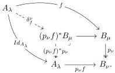
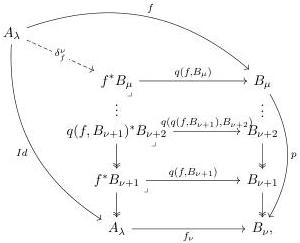

universal property of the pullback, we can construct the following diagram:

The map $\delta_f^\nu$ makes both triangles commutative. We will focus on the fact that $((f_\nu)^*p_\nu)\delta_f^\nu = Id_{A_\lambda}$, where $f_\nu = p_\nu f$. Assume that we have a map $p: B_\mu \to B_\nu$ with $\mu$ a limit ordinal, in particular the length of $p$ is a limit ordinal. Then a map $f: A_\lambda \to B_\mu$ is determinate by a family of maps $\{f_\gamma: A_\lambda \to B_\gamma\}$. Then we obtain:

where the map $\delta_f^\nu$ is given as the family of maps $(\delta_f^\nu)_\gamma$, each given by an intermediate pullback square in the diagram above.

Notation B.8. If the situation above, for $f: A_\lambda \to B_\mu$ we denote

$$\Gamma(B_\nu^\mu) := \{h: A_\lambda \to (p_\nu f)^* B_\mu \mid ((p_\nu f)^* p_\nu)h = Id_{A_\lambda}\}.$$

We can consider a more general case, if $A_\lambda \in Ob_\lambda(\mathcal{C})$ and $B_\mu \in Ob_\mu(\mathcal{C})$ with $\lambda < \mu$, then there is a unique display map $p: B_\mu \to A_\lambda$. We set

$$\Gamma(B_\lambda^\mu) := \{s: A_\lambda \to B_\mu \mid ps = Id_{A_\lambda}\}$$

115