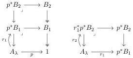

for this situation as well, since the object $A_\lambda$ will be inferred from the context.

If the contextual category is $\mathbb{C}_T$, then recalling theorem A.35, we can give an explicit description of the map $\delta_f^\nu$.

**Lemma B.9.** Assume that $f := [\langle t_\beta \rangle_{\beta < \nu}] : [\{x_\alpha : A_\alpha\}_{\alpha < \lambda}] \to [\{x_\beta : B_\beta\}_{\beta < \nu}]$ and there is a display map $p : [\{x_\beta : B_\beta\}_{\beta < \mu}] \to [\{x_\beta : B_\beta\}_{\beta < \nu}]$, then $\delta_f^\nu = [\langle x_\alpha, t_\beta \rangle_{\substack{\alpha < \lambda \\ \nu < \beta < \mu}}]$.

*Proof.* This follows by induction on $\mu$ and the explicit construction of pullbacks from theorem A.35. $\square$

In certain situations, the property above characterizes the map $\delta_f^\nu$.

**Lemma B.10.** If $[\{x_\beta : B_\beta\}_{\beta < \mu}]$ is an object of $\mathbb{C}_T$ and $\nu < \mu$ then $f \in \Gamma(B_\nu^\mu)$ if and only if $f = [\langle x_\beta, t_\gamma \rangle_{\beta < \nu < \gamma < \mu}]$, where for all $\nu < \gamma < \mu$, the rule $\{x_\beta : B_\beta\}_{\beta < \nu}, \{t_{\gamma'} : B_{\gamma'}\}_{\gamma' < \gamma} \vdash t_\gamma : B_\gamma$ is a derived rule.

The next result follows from the previous lemma, and is used in theorem B.41.

**Lemma B.11.** Let $A_\lambda, B_\mu$ objects of $\mathcal{C}$ and for each $\beta < \mu$ we have maps $r_{\beta+1} \in \Gamma(r_\beta^* \cdots r_1^* p^* B_{\beta+1})$ then there exists a unique sequence of maps $\{g_\beta : A_\lambda \to B_\beta\}_{\beta < \mu}$ such that for all $\beta < \mu$ we have $p_\beta g_{\beta+1} = g_\beta$ and $\delta_{g_\beta} = r_\beta$.

Some words about the previous lemma are in order. The expression $r_\beta^* \cdots r_1^* p^* B_{\beta+1}$ can be illustrated by the first two steps:

### B.3 The equivalence between $\kappa$-GAT and $\kappa$-CON

#### B.3.1 The functor $\mathbb{C} : \kappa$-GAT $\to \kappa$-CON

To establish this equivalence of categories, we first define a functor $\mathbb{C} : \kappa$-GAT $\to \kappa$-CON using the construction of section A.5. The proof again comes from [Car78, Section 2.4.1]. We register all preliminary results needed

116