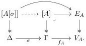
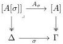

- The identity for $(V_A, E_A, f_A)$ is the identity of $[A] \twoheadrightarrow \Gamma$ as an object in $\mathcal{C}^\to$.

We now unpack the cartesian lifts for the induced functor $p_! : \mathrm{FIB}(\mathcal{C})_! \to \mathcal{C}_!$. Let $\sigma : \Delta \to \Gamma$ and $(V_A, E_A, f_A) \in \mathrm{FIB}(\mathcal{C})_!$ over $\Gamma$. Set $A[\sigma] := (V_A, E_A, f_A\sigma)$, pulling back along $f_A\sigma$, we obtain the commutative outer rectangle below

The universal property of the pullback on the right give us the unique map $A_\sigma : [A[\sigma]] \to [A]$. Therefore, a lift for $\sigma$ is given by the evident map $A_\sigma : (V_A, E_A, f_A\sigma) \to (V_A, E_A, f_A)$. From the definition of $A_\sigma$ the square

is a pullback, this implies that the square as a map in $\mathrm{FIB}(\mathcal{C})_!$ is a cartesian lift of $\sigma$ for $p_!$. Most importantly, this lift is uniquely determined by the composition $f_A\sigma$. Note that the transfinite composition of fibrations play no role in the construction. We summarize the discussion above in the following:

**Theorem B.57.** *For any $\kappa$-clan $\mathcal{C}$ there exist a full split comprehension category $(\mathcal{C}', \mathcal{E}, p_!, \iota_!)$ equivalent to $(\mathcal{C}, \mathrm{FIB}(\mathcal{C}), p, \iota)$.*

*Proof.* We apply the previous construction, this give us $(\mathcal{C}_!, \mathrm{FIB}(\mathcal{C})_!, p_!)$. Since the putative cartesian map is uniquely determined by the composition $f_A\sigma$, we can use a slight abuse of notation and write $A_\sigma := f_A\sigma$. Thus, if $\chi : \Xi \to \Delta$ is another map then $f(\sigma\chi) = (f\sigma)\chi$. This shows that the fibration $p_! : \mathrm{FIB}(\mathcal{C})_! \to \mathcal{C}_!$ is indeed split. The functor $\iota_! : \mathrm{FIB}(\mathcal{C})_! \to \mathcal{C}^\to$ is defined as $\iota_!(V_A, E_A, f_A) := \iota([A] \twoheadrightarrow \Gamma) = [A] \twoheadrightarrow \Gamma$; similarly for arrows. The comprehension category $(\mathcal{C}_!, \mathrm{FIB}(\mathcal{C})_!, p_!, \iota_!)$ is full, since $(\mathcal{C}, \mathrm{FIB}(\mathcal{C}), p, \iota)$ is full. $\square$

A *category with attributes* is a comprehension category $(\mathcal{C}, \mathcal{E}, p, F)$ such that $p$ is a discrete fibration. Equivalently, a category with attributes can be defined by the following data:

139