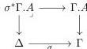

1. A category $\mathcal{C}$ with a terminal object 1.
2. A presheaf $\mathsf{Ty} : \mathcal{C}^{op} \to \mathbf{Set}$.
3. A function that assigns to each object $A \in \mathsf{Ty}(\Gamma)$, an object $\Gamma.A \in \mathcal{C}$, together with a map $\Gamma.A \to \Gamma$.
4. For each $A \in \mathsf{Ty}(\Gamma)$ and $\sigma : \Delta \to \Gamma$, a pullback square

**Corollary B.58.** *For any $\kappa$-clan $\mathcal{C}$ there exist a category with attributes equivalent to $\mathcal{C}$.*

*Proof.* Theorem B.57 give us a full split comprehension category $(\mathcal{C}_!, \mathsf{FIB}(\mathcal{C})_!, p_!, \iota_!)$. We take the category to be $\mathcal{C}_! = \mathcal{C}$. The additional data is given in the obvious way. Defining $\mathsf{Ty}(\Gamma) := (\mathsf{FIB}(\mathcal{C})_!)_\Gamma$, for each $A \in \mathsf{Ty}(\Gamma)$, we get $[A] \to \Gamma$ as described above. The required pullbacks are given by the cartesian lifts of $p_!$. Furthermore, these pullbacks are computed strictly along compositions, since $p_!$ is a split fibration. $\square$

Our next goal is to define a $\kappa$-contextual category equivalent to $\mathcal{C}$ from the category with attributes given by theorem B.58. In particular, for each object $\Gamma \in \mathcal{C}$, we get a $\kappa$-contextual category $\mathcal{C}(\Gamma)$. We start with the following:

**Definition B.59.** The category structure is given by the following data:

- **Objects:** For each ordinal $\mu < \kappa$, we define the set $Ob_\mu(\mathcal{C}(\Gamma))$ inductively over $\mu$;
  - If $\mu = \lambda + 1$, then we define $Ob_\mu(\mathcal{C}(\Gamma)) := \mathsf{Ty}([A_\lambda])$. More explicitly, an object $A_\mu \in Ob_\mu(\mathcal{C}(\Gamma))$ can be represented as the sequence
    $$A_\mu \to A_\lambda \to \cdots \to \Gamma$$
    and comes with a fibration $A_\mu \to \Gamma$.
  - If $\mu$ is a limit ordinal, then $Ob_\mu(\mathcal{C}(\Gamma))$ is the collection of objects of the form $A_\mu := \mathsf{Lim}_{\lambda < \mu} A_\lambda$ obtained as the transfinite composition of a sequence

$$\cdots \to A_\lambda \to \cdots \to \Gamma.$$

140