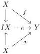
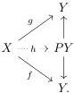

care taken - mostly replacing objects by fibrant and cofibrant replacement of objects before applying the usual construction. The main significant difference is that the homotopy category (defined in terms of homotopy class of maps between bifibrant objects as we will recall below) is no longer equivalent to $\mathcal{M}[W^{-1}]$ - the localization of $\mathcal{M}$ at weak equivalence, but only to $\mathcal{M}^{\mathrm{cof\vee fib}}[W^{-1}]$ the localization the full subcategory of objects that are either fibrant or cofibrant at the weak equivalences. The problem is that the axioms of a weak model category allows us to take a fibrant replacement of a cofibrant object $C$ as a (trivial cofibration/fibration) factorization of $C \to 1$. Similarly we can take a cofibrant replacement of a fibrant objects, but there is no way to do similar replacement with an object which is neither fibrant nor cofibrant.

We now quickly go over some aspects of the construction of the homotopy category of a weak model category, the results mentioned below are all proven in section 2.1 and 2.2 of [Hen20].

**Construction C.5.** If $X$ is a bifibrant object (i.e. fibrant and cofibrant), we can form a *cylinder objects* $IX$ for $X$ as a (cofibration, trivial fibration) factorization:

$$X \coprod X \hookrightarrow IX \xrightarrow{\sim} X$$

and a path objects for $X$ as a (trivial cofibration, fibration) factorization

$$X \stackrel{\sim}{\hookrightarrow} PX \twoheadrightarrow X \times X.$$

Given a pair of maps $f, g : X \rightrightarrows Y$ between bifibrant objects, we say they are homotopic if there is a dotted map $h$ making the diagram below commutative:

or equivalently a map $h$

146