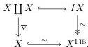
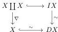
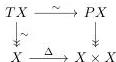

This is an equivalence relation, and the homotopy category $\mathrm{Ho}(\mathcal{M})$ of $\mathcal{M}$ can be defined as the category of bifibrant objects with homotopy class of maps between them. Moreover, this category is equivalent to the formal localization $\mathcal{M}^{\mathrm{cof\vee fib}}[W^{-1}]$.

**Construction C.6.** Note that if an object $C \in \mathcal{M}$ is only cofibrant and not fibrant we cannot define a cylinder object in the same way as above since the factorization axiom does not allow us to factor the maps $X \coprod X \to X$ if $X$ is not fibrant. In place of this, we can consider a fibrant replacement $X \stackrel{\sim}{\hookrightarrow} X^{\mathrm{FIB}} \twoheadrightarrow 1$, and then form a factorization:

This object $IX$, and more generally any object fitting into a diagram:

is called a weak cylinder object. Dually, if $Y$ is fibrant we define a weak path object of $Y$ as any object $PY$ that fits into a diagram:

We can then show that for a pair of maps $X \Rightarrow Y$ from a cofibrant object $X$ to a fibrant object $Y$ the following are equivalent:

- $f$ is homotopic to $g$ in terms of a weak cylinder object for $X$.
- $f$ is homotopic to $g$ in terms of a weak path object for $Y$.
- $f$ and $g$ are equal in the localization $\mathcal{M}^{\mathrm{cof\vee fib}}[W^{-1}]$.

Moreover, any arrow $X \to Y$ in the localization $\mathcal{M}^{\mathrm{cof\vee fib}}[W^{-1}]$ comes from an arrow $X \to Y$ in $\mathcal{M}$.

147