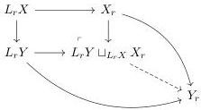

## C.2 Weak Reedy model structure

Before doing all the constructions, we need to set up the formalism needed for them. In this section, we study Reedy weak model categories. These are, as the name suggests, the counterpart of Reedy model categories. Most of the proofs are straightforward adaptation of the classical ones, so they are omitted.

**Definition C.7.** A *Reedy category* is a category $R$ together with two wide subcategories $R_+$ and $R_-$ and a functor $deg : R \to \alpha$, where $\alpha$ is an ordinal, such that:

1. For every non-identity arrow $a \to b \in R_+$, $\deg(a) < \deg(b)$.
2. For every $a \to b \in R_-$ a non-identity arrow, $\deg(b) < \deg(a)$.
3. Every arrow in $R$ factors uniquely as an arrow in $R_-$ followed by an arrow in $R_+$.

When the subcategory $R_-$ consists of identity arrows only, then $R$ is called a *direct category*. Similarly, when the subcategory $R_+$ consists of identity arrows only, then $R$ is called an *inverse category*.

Let $R$ be a Reedy category and $\mathcal{M}$ be a weak model category. Consider $\mathcal{M}^R$ the category of $R$-shaped diagram in $\mathcal{M}$. Given $X : R \to \mathcal{M}$ such a diagram and $r \in R$ any object. The *latching object* at $r$ is the colimit (if it exists)

$$L_r X := \mathsf{Colim}_{s \in (R_+/r) - \{Id_r\}} X_s.$$

Dually, the *matching object* at $r$ is the limit (if it exists)

$$M_r X := \mathsf{Lim}_{s \in (r/R_-) - \{Id_r\}} X_s.$$

**Definition C.8.** A map $f : X \to Y$ in $\mathcal{M}^R$ is said to be a *(trivial) Reedy cofibration* at $r \in R$ if the colimit $L_r Y \sqcup_{L_r X} X_r$ exists and the induced dotted map in the diagram below

148