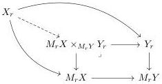

is a (trivial) cofibration in $\mathcal{M}$.

Dually, $f : X \to Y$ in $\mathcal{M}^R$ is said to be a (trivial) Reedy fibration at $r \in R$ if the limit $M_r X \times_{M_r Y} Y_r$ exists and the induced dotted map in the diagram below

exists and is a (trivial) fibration in $\mathcal{M}$.

A map is said to be a (trivial) Reedy (co)fibration if it is one at each $r \in R$.

Remark C.9. We want to clarify that in theorem C.8 the colimit $L_r Y \sqcup_{L_r X} X_r$ is considered as a single colimit and not as a pushout using the objects $L_r X$ and $L_r Y$. It is possible that $L_r Y \sqcup_{L_r X} X_r$ exists without the colimit $L_r Y$ or $L_r X$ existing. Explicitly, it is the colimits of all the $X_i$ for $i \in R^+/r$ and of the $Y_i$ for $i \in R^+/r - \{id_r\}$, with all the maps coming from the functoriality in $i$ and the natural map $X_i \to Y_i$. We apply the same logic to the limit $M_r X \times_{M_r Y} Y_r$.

Definition C.10. A Reedy category is said to be locally finite if for any object $X \in R$ the categories $(R_+/X)$ and $(R_-/X)$ are finite.

It is a classical result that for any Quillen model category $\mathcal{M}$ and a Reedy category $R$ that the category of functors $\mathcal{M}^R$ carries a model structure in which the weak equivalences are the level-wise weak equivalences, the (trivial) (co)fibrations are precisely the Reedy (trivial) (co)fibrations. The same result can be obtained if we simply assume that the base category carries a weak model structure.

Theorem C.11. Assume that $\mathcal{M}$ is a weak model category and that $R$ is a locally finite Reedy category. Then there is a weak model structure on $\mathcal{M}^R$ such that a map $f : X \to Y$ is:

1. A weak equivalence if and only if $f_r : X_r \to Y_r$ is a weak equivalence for all $r \in R$.

149