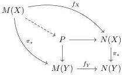

Proof. We only need to show that for every fibration $p: X \to Y$ the following square

$$\begin{array}{c} \mathcal{P}(N(X)) \xrightarrow{f_X^*} \mathcal{P}(M(X)) \\ \downarrow \exists \qquad \qquad \qquad \qquad \downarrow \exists \\ \mathcal{P}(N(Y)) \xrightarrow{f_Y^*} \mathcal{P}(M(Y)). \end{array}$$

commutes. From theorem 2.26 this is equivalent to saying that the dotted map in

is surjective. But this is exactly the characterization of anodyne fibrations given in theorem 2.19. □

This allows us to deduce the key result of invariance of formulas along anodyne fibrations of models. Basically, the validity of formulas is preserved by anodyne fibrations of models:

**Corollary 2.32.** Let $\mathcal{C}$ be a clan and let $f: M \twoheadrightarrow N$ be an anodyne fibration between two $\mathcal{C}$-models. For $c \in \mathcal{C}$, let $x \in M(c)$ and $\phi \in \mathbb{L}_{\lambda}^{\mathcal{C}}$ be any formula. Then

$$M \vdash \phi(x) \Leftrightarrow N \vdash \phi(f(x))$$

Proof. As $f: M \to N$ is an anodyne fibration, it follows from theorem 2.31 that the map $f^*: \mathcal{P}(N) \to \mathcal{P}(M)$ is a morphism of boolean algebra over $\mathcal{C}$. Hence, by initiality of $\mathbb{L}_{\lambda}^{\mathcal{C}}$, the unique morphism $|\cdot|_M: \mathbb{L}_{\lambda}^{\mathcal{C}} \to \mathcal{P}(M)$ is obtained as a composite

$$\mathbb{L}_{\lambda}^{\mathcal{C}} \xrightarrow{|\cdot|_N} \mathcal{P}(N) \xrightarrow{f^*} \mathcal{P}(M).$$

By definition, $M \vdash \phi(x)$ means that $x \in |\phi|_M$ while $N \vdash \phi(f(x))$ means that $x \in f^*|\phi|_N$, hence the result immediately follows. □

24