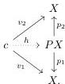

If we denote this map by $i$ then for $X$ any model of $T$ we can easily check that

$$X \vdash \phi(v) \Leftrightarrow X \vdash i(\phi)(v)$$

for any $c \in \mathcal{C}_T$ and $\phi \in \mathbb{L}_\lambda^T(c)$, where the left-hand side is interpreted in the sense of theorem 2.1 while the right-hand side is in terms of theorem 2.36.

Note that we do expect these to be the same. Informally, $\mathbb{L}_\lambda^T$ corresponds to an $\mathcal{L}_{\kappa,\lambda}$ logic, in the sense that quantifiers can only be applied to formulas in $\kappa$-small contexts — applied to less than $\kappa$-many variables at the same time—while $\mathbb{L}_\lambda^\mathcal{M}$ corresponds to an $\mathcal{L}_{\infty,\lambda}$ logic, where quantifiers can be applied to arbitrarily many formulas at the same time.

**Theorem 2.38.** *Let $\mathcal{M}$ be a weak model category, $c \in \mathcal{M}$ a cofibrant object and $\phi \in \mathbb{L}_\lambda^\mathcal{M}(c)$.*

- • $1^{st}$ **invariance theorem:** *Let $v_1, v_2 : c \to X$ be two homotopically equivalent maps with $X$ fibrant. Then*

$$X \vdash \phi(v_1) \quad \Leftrightarrow \quad X \vdash \phi(v_2).$$

- • $2^{nd}$ **invariance theorem:** *Let $f : X \to Y$ be a weak equivalence between two fibrant objects and $v : c \to X$ any map. Then*

$$X \vdash \phi(v) \quad \Leftrightarrow \quad Y \vdash \phi(fv).$$

*Proof.* We start by first observing that the second invariance theorem in the special case where $f$ is a trivial fibration immediately follows from theorem 2.32 as a trivial fibration $f$ has the right lifting property against all core cofibrations and hence is sent to an anodyne fibration in $\text{Mod}(\mathcal{M}^{\text{COF}})$ by the functor from theorem 2.35.

We use this to prove the $1^{st}$ invariance theorem: If $v_1, v_2 : c \to X$ are homotopic then there exists a map $h$:

26