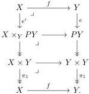
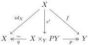

map between bifibrant objects we can form the pullbacks:

Note that because the fibrations $PY \to Y$ are trivial fibrations, the map $X \times_Y PY \to X$ in the diagram above is also a trivial fibration. The total vertical maps are both the identity. Which gives us a diagram:

Where $p$ is the map $X \times_Y PY \twoheadrightarrow X \times Y \xrightarrow{\pi_2} Y$. Note that all maps in this diagram are weak equivalences due to the 2-out-of-3 condition. We can now prove the theorem, we have

$$X \vdash \phi(v) \Leftrightarrow X \times_Y PY \vdash \phi(e'v)$$

because $v = qe'v$ and $q$ is a trivial fibration, and

$$X \times_Y PY \vdash \phi(e'v) \Leftrightarrow Y \vdash \phi(fv)$$

because $p$ is a trivial fibration and $fv = pe'v$. Hence, combining the two

$$X \vdash \phi(v) \Leftrightarrow Y \vdash \phi(fv)$$

Finally, we explain how Quillen adjunctions act on formulas. A *Quillen adjunction* between two weak model categories is an adjunction

$$L : \mathcal{C} \leftrightarrows \mathcal{D} : R$$

where the left adjoint $L$ sends cofibrations to cofibrations and the right adjoint $R$ sends fibrations to fibrations.

28