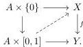

### 3.5 Topological spaces

Here we recall the Quillen model structure on the category of topological spaces **Top** [Qui06]. Recall that a map $f : X \to Y \in \mathbf{Top}$ is a *weak homotopy equivalence* if for all $x \in X$ and $n \geq 1$ the induced map $f_* : \pi_n(X, x) \to \pi_n(Y, f(x))$ is an isomorphism of groups and for $n = 0$ is a bijection. Additionally, the map $f$ is a *Serre fibration* if for any $CW$-complex $W$ the following square has a diagonal filler:

**Theorem 3.23.** *The category **Top** has a model category structure such that:*

1. *Weak equivalences are the weak homotopy equivalences.*
2. *Fibrations are the Serre fibrations.*
3. *Cofibrations are the maps with the left lifting property against trivial fibrations.*

*Moreover, this model structure is cofibrantly generated. The generating cofibrations is the set of boundary inclusions $\{S^{n-1} \to D^n | n \in \mathbb{N}\}$. The set $\{D^n \to D^n \times [0, 1] | n \in \mathbb{N}\}$ generates trivial cofibrations.*

We can immediately write some of the relevant type axiom of the resulting theory:

- $\vdash 0\text{-CW Type.}$
- $x, y : 0\text{-CW} \vdash 1\text{-CW}(x, y)\text{ Type.}$
- $x : 0\text{-CW}, \gamma : 1\text{-CW}(x, x) \vdash 2\text{-CW}(x, \gamma)\text{ Type.}$
- $\vdots$

Note that the language associated to the model structure allows us to express properties of topological spaces without relying on a specific set of axioms. However, this presents a limitation coming from the fact that we do not have an equality type. It is a classic result that there is no finitary presentation of a topological space. But in our setting, when $X$ is a CW-complex *i.e.*, it is obtained as an iterated pushout of cells, then a continuous map $D^n \to X$ can be written in the language above.

42