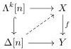

### 3. Cofibrations are the monomorphisms.

The class of cofibrations is generated by $I := \{\partial\Delta[n] \hookrightarrow \Delta[n]|n \in \mathbb{N}\}$ and trivial cofibrations are generated by $J := \{\Lambda^k[n] \to \Delta[n]|n \in \mathbb{N} \text{ and } 0 \leq k \leq n\}$.

Similarly, a map $f : X \to Y$ between simplicial sets is an inner Kan fibration if it has the right lifting property for all inner horn inclusions, i.e., the solid diagram below a diagonal filler

for all $0 < k < n \in \mathbb{N}$. The simplicial set $X$ is a quasi-category if the unique map to the terminal presheaf is an inner Kan fibration. This is the result from [Joy08]:

**Theorem 3.26.** The category of simplicial sets **sSet** carries a model structure in which:

1. Weak equivalences are the weak categorical equivalences.
2. Fibrations are the inner Kan fibrations.
3. Cofibrations are the monomorphisms.

The class of cofibrations is generated by $I := \{\partial\Delta[n] \hookrightarrow \Delta[n]|n \in \mathbb{N}\}$, the set of boundary inclusions.

Notice that both model structures have the same class of generating cofibrations. Hence, we expect that they have the same theories. We get a type for each cofibration in $I$. The first elements in this list of types are:

- $\vdash$ 0-simplex Type.
- $\sigma_0, \sigma_1 : 0$-simplex $\vdash$ 1-simplex$(\sigma_0, \sigma_1)$ Type.
- $\sigma_0, \sigma_1, \sigma_2 : 0$-simplex, $\quad \sigma_{01} : 1$-simplex$(\sigma_0, \sigma_1)$, $\quad \sigma_{12} : 1$-simplex$(\sigma_1, \sigma_2)$, $\quad \sigma_{02} : 1$-simplex$(\sigma_0, \sigma_2) \vdash 2$-simplex$(\sigma_0, \sigma_1, \sigma_2, \sigma_{01}, \sigma_{12}, \sigma_{02})$ Type.
- $\vdots$

44