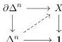

the language of the Kan-Quillen model structure is only meant to be applied to Kan complexes, while the language of the Joyal model structure can be applied to quasi-categories.

**Example 3.27.** A Kan complex $X$ is contractible if it is weakly homotopy equivalent to $\mathbf{1}$. This is just to say that for any $n \geq 0$ we can find a lift

which expresses the fact that the unique map $X \rightarrow \mathbf{1}$ is a weak homotopy equivalence. Note that $X$ must satisfy an infinite number of conditions:

- For $n = 0$ this says: $\exists \sigma_0 : 0\text{-simplex}$,
- For $n = 1$ this says: $\forall \sigma_0, \sigma_1 : 0\text{-simplex}, \exists \sigma_{01} : 1\text{-simplex}(\sigma_0, \sigma_1)$,
- For $n = 2$ this says:

$$\begin{aligned} &\forall \sigma_0, \sigma_1 : 0\text{-simplex} \, \sigma_{01} : 1\text{-simplex}(\sigma_0, \sigma_1), \sigma_{12} : 1\text{-simplex}(\sigma_1, \sigma_2), \\ &\sigma_{02} : 1\text{-simplex}(\sigma_0, \sigma_2), \exists \sigma_{012} : 2\text{-simplex}(\sigma_0, \sigma_1, \sigma_2, \sigma_{01}, \sigma_{12}, \sigma_{02}). \end{aligned}$$

One continues unpacking the conditions and takes the infinite conjunction of the formulas.

Alternatively, we can note that the domain of a trivial cofibration $i_n : \partial \Delta^n \hookrightarrow \Delta^n$ give us the context, or hypotheses, of the statement. In this case, the codomain gives us the type where the conclusion holds. If we accept this, let us write, $t \in \mathbb{L}^{\mathbf{sSet}}(\partial \Delta^n)$ for a term (formula) which expresses a property in the context $\partial \Delta^n$, similarly $t' \in \mathbb{L}^{\mathbf{sSet}}(\Delta^n)$ for a formula in the context $\Delta^n$. With this convention, we do not have to use the theory explicitly. When we apply the quantifiers, universal or existential, we move these formulas to $\mathbb{L}^{\mathbf{sSet}}(\emptyset)$ and ask whether a fibrant object satisfies the resulting formula. For $\top \in \mathbb{L}^{\mathbf{sSet}}(\Delta^n)$ then for $i_n : \partial \Delta^n \hookrightarrow \Delta^n$ and $j_n : \emptyset \to \partial \Delta^n$ we get maps

$$\exists_{i_n} : \mathbb{L}^{\mathbf{sSet}}(\Delta^n) \to \mathbb{L}^{\mathbf{sSet}}(\partial \Delta^n) \text{ and } \forall_{j_n} : \mathbb{L}^{\mathbf{sSet}}(\partial \Delta^n) \to \mathbb{L}^{\mathbf{sSet}}(\emptyset),$$

and thus the formula $\forall_{j_n} \exists_{i_n} \top : \mathbb{L}^{\mathbf{sSet}}(\emptyset)$ would say that a Kan complex satisfies the corresponding lifting problem. For a Kan complex to be contractible, it needs to satisfy formulas for all $n \in \mathbb{N}$. Therefore,

$$\text{isContr}(X) := (X \vdash \bigwedge_{n \in \mathbb{N}} \forall_{j_n} \exists_{i_n} \top).$$

46