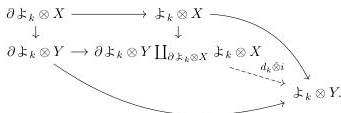

We are now convinced that contractibility can be written in the language we just described. Theorem 3.27 indicates that we might not need to get an explicit syntax from the generating set of cofibrations. Instead, we might just quantify over the required cofibrations. The main reason this is preferable over explicitly defining the syntax is that in general such syntax is complicated to write, see for example section 3.8. The previous example shows that we might prefer to choose simplifications that make our sentences easier to read. This is specially true for contexts like the ones covered in the following section.

### 3.7 Reedy languages

The purpose of this subsection is to describe the language for the category $\mathcal{M}^{K^{op}}$, where $K$ is a Reedy category and $\mathcal{M}$ is a model category whose language we know. This encompasses some of the previous examples and opens the door to further applications.

Recall that if $\mathcal{M}$ is a cofibrantly generated model category whose cofibrations are generated by a well-founded set of cofibrations $I$, then for each cofibration $A \hookrightarrow B \in I$ we can associate a type introduction axiom $\bar{A} \vdash \bar{B}$ Type, where $\bar{A}$ is a well-formed context previously constructed.

Let $K$ be a Reedy category with degree function $\deg : K \to \omega$. This restriction is artificial since we could consider more general Reedy categories, however, for the examples this construction is aimed at, this is enough. The objects of $K$ have a well-founded order relation induced by the degree function.

**Construction 3.28.** Let $\partial \updownarrow_k$ be the latching object of the representable functor $\updownarrow_k$ and $d_k : \partial \updownarrow_k \to \updownarrow_k$ the induced map. There is a bifunctor

$$\otimes : \mathbf{Set}^{K^{op}} \times \mathcal{M} \to \mathcal{M}^{K^{op}}$$

defined by $(A \otimes X)_k := \coprod_{A_k} X$. Let $I$ be as above, given $i : X \to Y \in I$ and $k \in K$ we apply the usual Leibniz construction and obtain the dashed arrow below

47